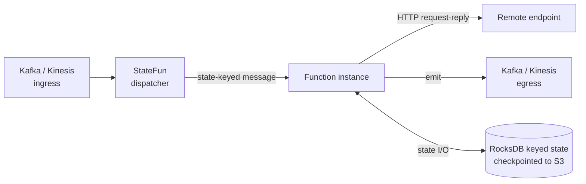

# Kzmlabs StateFun

> Stateful actors on Apache Flink — durable per-key state, exactly-once messaging, Kafka and Kinesis I/O, Kubernetes-native deployment. The actively maintained continuation of [Apache Stateful Functions](https://github.com/apache/flink-statefun) for Flink 2.x and Java 21.

[](https://central.sonatype.com/artifact/io.github.kzmlabs.flinkstatefun/statefun-bom)
[](https://github.com/kzmlabs/flink-statefun/pkgs/container/flink-statefun)
[](LICENSE)
[](https://github.com/kzmlabs/flink-statefun/actions/workflows/ci.yml?query=branch%3Arelease)
[](https://github.com/kzmlabs/flink-statefun/actions/workflows/e2e-test.yml?query=branch%3Arelease)
[](https://github.com/kzmlabs/flink-statefun/actions/workflows/codeql.yml?query=branch%3Arelease)
[](https://scorecard.dev/viewer/?uri=github.com/kzmlabs/flink-statefun)

📖 **[Documentation](https://kzmlabs.github.io/flink-statefun/)** &nbsp;·&nbsp; ⚡ **[Quickstart](https://kzmlabs.github.io/flink-statefun/quickstart/)** &nbsp;·&nbsp; 📦 **[Maven Central](https://central.sonatype.com/namespace/io.github.kzmlabs.flinkstatefun)** &nbsp;·&nbsp; 🐳 **[GHCR](https://github.com/kzmlabs/flink-statefun/pkgs/container/flink-statefun)** &nbsp;·&nbsp; 🆚 **[vs Apache StateFun](https://kzmlabs.github.io/flink-statefun/upstream-vs-kzm/)**

---

## What is this?

You write a function keyed by a logical id. The runtime gives it per-key durable state, routes messages to it, replays on failure, and connects it to Kafka and Kinesis. Actor programming on top of Apache Flink — without writing a Flink job by hand.



**Use cases:** event-driven microservices, real-time fraud detection, IoT digital twins, payment orchestration, actor-style stateful compute, distributed sagas, serverless stream processing.

## Why this exists

Apache Stateful Functions stopped releasing in October 2024 at 3.4.0, locked to Flink 1.16 and Java 11. Anyone wanting to run it against modern Flink either pinned old dependencies or vendored their own patches. Kzmlabs StateFun is the public, actively maintained branch — same code, modern stack, no vendor lock-in.

| | Apache StateFun 3.4.0 | Kzmlabs StateFun KZM-3.1 |
|---|---|---|
| **Flink runtime** | 1.16.2 | **2.2.0** |
| **Java baseline** | 11 | **21** |
| **Maven group** | `org.apache.flink` | `io.github.kzmlabs.flinkstatefun` |
| **Kinesis I/O** | Flink 1.x consumer | **Restored** on Flink 2.x source/sink |
| **K8s release gate** | None | **Mandatory** kind + Flink Operator + LocalStack |
| **Active CI** | Inactive after 3.4.0 | Dependabot, CodeQL, Scorecard, Trivy |
| **Release cadence** | Dormant | Active (Maven Central + GHCR) |

Full migration notes: **[Differences from Apache StateFun](https://kzmlabs.github.io/flink-statefun/upstream-vs-kzm/)**.

## Quickstart

### 1. Add the dependency

```xml
<dependencyManagement>
  <dependencies>
    <dependency>
      <groupId>io.github.kzmlabs.flinkstatefun</groupId>
      <artifactId>statefun-bom</artifactId>
      <version>3.4.0-KZM-3.1</version>
      <type>pom</type>
      <scope>import</scope>
    </dependency>
  </dependencies>
</dependencyManagement>

<dependency>
  <groupId>io.github.kzmlabs.flinkstatefun</groupId>
  <artifactId>statefun-sdk-java</artifactId>
</dependency>
```

### 2. Write a stateful function

```java
import org.apache.flink.statefun.sdk.java.*;
import org.apache.flink.statefun.sdk.java.message.Message;

public class GreeterFn implements StatefulFunction {

  static final TypeName TYPE = TypeName.typeNameFromString("example/greeter");

  @Override
  public CompletableFuture<Void> apply(Context ctx, Message msg) {
    String name = msg.asUtf8String();
    System.out.println("Hello, " + name + "!");
    return ctx.done();
  }
}
```

### 3. Wire it in `module.yaml`

```yaml
kind: io.statefun.endpoints.v2/http
spec:
  functions: example/*
  urlPathTemplate: http://my-fn-svc:8080/statefun
```

### 4. Run the runtime

```bash
docker run --rm -p 8081:8081 \
  -v $(pwd)/module.yaml:/opt/flink/conf/module.yaml \
  ghcr.io/kzmlabs/flink-statefun:3.4.0-KZM-3.1
```

Full walkthrough → **[Quickstart guide](https://kzmlabs.github.io/flink-statefun/quickstart/)**.

## Module structure

| Module | Purpose |
|---|---|
| [`statefun-sdk-java`](statefun-sdk-java/) | Java SDK for remote functions |
| [`statefun-sdk-embedded`](statefun-sdk-embedded/) | Embedded SDK for co-located functions |
| [`statefun-flink-core`](statefun-flink/statefun-flink-core/) | Core Flink integration |
| [`statefun-flink-distribution`](statefun-flink/statefun-flink-distribution/) | Distribution JAR for deployment |
| [`statefun-flink-runner`](statefun-flink-runner/) | Uber JAR for K8s deployment via Flink Operator |
| [`statefun-kafka-io`](statefun-kafka-io/) | Kafka ingress/egress connectors |
| [`statefun-kinesis-io`](statefun-kinesis-io/) | AWS Kinesis ingress/egress connectors |
| [`statefun-shaded`](statefun-shaded/) | Relocated Protobuf to avoid version conflicts |
| [`statefun-docker`](statefun-docker/) | Distribution Docker image build |
| [`statefun-bom`](statefun-bom/) | Bill of Materials for version alignment |
| [`statefun-e2e-tests/statefun-e2e-k8s-native`](statefun-e2e-tests/statefun-e2e-k8s-native/) | Kubernetes-native end-to-end test gate |

## Building from source

```bash
git clone https://github.com/kzmlabs/flink-statefun.git
cd flink-statefun
./mvnw clean install                  # full build + K8s E2E gate (~25–30 min)
./mvnw clean install -Dskip.k8s.e2e   # skip the kind cluster (~5–7 min)
./mvnw clean install -DskipTests      # compile + package only (~3–5 min)
```

**Prerequisites:** Java 21, Maven 3.9+ (or `./mvnw`), Docker (for the K8s E2E gate).

Restricted-network builds: set `IMAGE_REGISTRY_PREFIX=harbor.example.com/dockerhub-proxy/` to pull all base images through your registry mirror — every Dockerfile and k8s manifest honours it. Full details in the **[build guide](https://kzmlabs.github.io/flink-statefun/build/)**.

## Versioning and compatibility

| Kzmlabs version | Apache StateFun base | Flink | Java | Status |
|---|---|---|---|---|
| `3.4.0-KZM-3.1` | 3.4.0 | 2.2.0 | 21 | Latest |
| `3.4.0-KZM-3.0` | 3.4.0 | 2.2.0 | 21 | Stable |
| `3.4.0-KZM-2.0` | 3.4.0 | 2.2.0 | 21 | Stable |

Releases are signed via Sigstore keyless attestation. Verify with:

```bash
gh attestation verify oci://ghcr.io/kzmlabs/flink-statefun:3.4.0-KZM-3.1 --owner kzmlabs
```

## Branch model

| Branch | Role |
|---|---|
| **`release`** | Active development — all PRs target this branch. |
| `master` | Vestigial Apache upstream pointer. Not used for development. |

## Contributing

Contributions are welcome. See **[CONTRIBUTING.md](CONTRIBUTING.md)** for the workflow, and the **[release process](https://kzmlabs.github.io/flink-statefun/release-process/)** for how versions are cut.

In short:

1. Branch from `release`.
2. Run `./mvnw spotless:apply` and `./mvnw -Dskip.k8s.e2e install` locally.
3. Open a PR against `release`. CI runs the full K8s E2E gate.

## Security

Found a vulnerability? See **[SECURITY.md](SECURITY.md)** for the reporting process.

The repo runs CodeQL, OpenSSF Scorecard, Trivy CVE scans, and Dependabot on every push. Releases include SLSA build provenance and Sigstore attestations.

## License

Licensed under the [Apache License 2.0](LICENSE). Originally derived from [Apache Flink Stateful Functions](https://github.com/apache/flink-statefun) — see [NOTICE](NOTICE) for upstream attribution.

## Citing

If you use Kzmlabs StateFun in research, please cite via the [`CITATION.cff`](CITATION.cff) file (GitHub's "Cite this repository" button).

## Links

- 📖 **Documentation** — https://kzmlabs.github.io/flink-statefun/
- 📦 **Maven Central** — https://central.sonatype.com/namespace/io.github.kzmlabs.flinkstatefun
- 🐳 **Container images** — https://github.com/kzmlabs/flink-statefun/pkgs/container/flink-statefun
- 📜 **Changelog** — [CHANGELOG.md](CHANGELOG.md)
- 🤝 **Code of conduct** — [CODE_OF_CONDUCT.md](CODE_OF_CONDUCT.md)
- 👥 **Maintainers** — [MAINTAINERS.md](MAINTAINERS.md)
- 🔗 **Upstream Apache project** — https://github.com/apache/flink-statefun

---

<sub>**Topics:** apache-flink · stateful-functions · statefun · stream-processing · event-driven-architecture · event-driven-microservices · distributed-systems · actor-model · stateful-serverless · kubernetes · flink-kubernetes-operator · kafka · kinesis · rocksdb · exactly-once · java-21 · jvm · real-time-analytics</sub>
