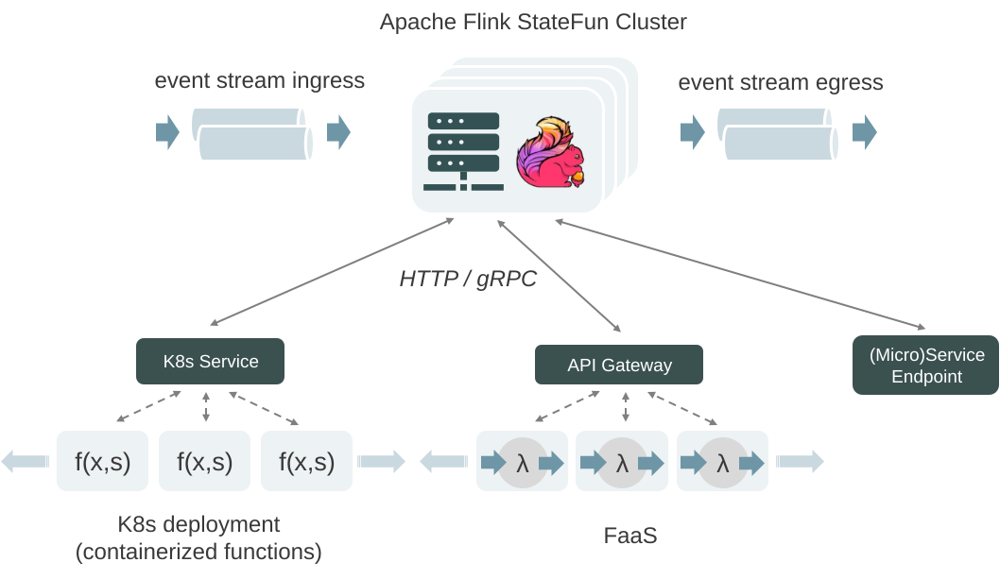

# Kzmlabs Flink StateFun

[](https://github.com/kzmlabs/flink-statefun/actions)
[](https://search.maven.org/search?q=g:io.github.kzmlabs.flinkstatefun)
[](LICENSE)

An actively maintained continuation of Stateful Functions updated for **Flink 2.2.0** and **Java 21**, published to Maven Central under the `io.github.kzmlabs.flinkstatefun` group ID.

> Originally based on [Apache Flink Stateful Functions](https://github.com/apache/flink-statefun), which has been archived upstream. This project is now independently maintained by Kzmlabs.

## Why This Project?

The upstream Apache Flink StateFun project has been archived and is no longer actively maintained. Kzmlabs Flink StateFun picks up where it left off:

- **Updates to Flink 2.2.0** — The latest stable Flink release
- **Requires Java 21** — Modern Java runtime with improved performance
- **Published to Maven Central** — Easy dependency management via `io.github.kzmlabs.flinkstatefun` coordinates
- **Maintains compatibility** — Same API as Apache StateFun 3.3.x
- **Kubernetes-native** — Release-gated K8s E2E test suite running on the Flink Kubernetes Operator

## Quick Start

### Maven Dependency

```xml
<dependency>
    <groupId>io.github.kzmlabs.flinkstatefun</groupId>
    <artifactId>statefun-sdk-java</artifactId>
    <version>3.4.0-KZM-2.0</version>
</dependency>
```

### Docker Image

```bash
docker pull ghcr.io/kzmlabs/flink-statefun:latest
```

### What is Stateful Functions?

Stateful Functions is an API that simplifies building **distributed stateful applications** with a **runtime built for serverless architectures**. It brings together the benefits of stateful stream processing with a runtime for modeling stateful entities that supports location transparency, concurrency, scaling, and resiliency.

<p align="center">
  
</p>

## Table of Contents

- [Core Concepts](#core-concepts)
- [Getting Started](#getting-started)
- [Building from Source](#building-from-source)
- [Module Structure](#module-structure)
- [Differences from Apache StateFun](#differences-from-apache-statefun)
- [Contributing](#contributing)
- [License](#license)

## Core Concepts

### Stateful Functions

A _stateful function_ is a small piece of logic invoked through messages. Each function exists as a uniquely invokable _virtual instance_ of a _function type_, addressed by its `type` and a unique `ID`.

- Functions can be invoked from ingresses or other functions
- Virtual instances are not all active in memory simultaneously
- Each instance has private, local state

### Ingresses and Egresses

- **Ingresses** - Entry points for events (message queues, HTTP servers, etc.)
- **Routers** - Determine which function instance handles an event
- **Egresses** - Send events out from the application

### Modules

A _module_ is the entry point for adding primitives (ingresses, egresses, routers, functions) to an application. Multiple modules can be combined into a single application.

## Getting Started

### Prerequisites

- **Java 21** (required)
- **Maven 3.5+**
- **Docker** (for running the StateFun cluster)

### Example: Remote Function

1. Add the SDK dependency:

```xml
<dependency>
    <groupId>io.github.kzmlabs.flinkstatefun</groupId>
    <artifactId>statefun-sdk-java</artifactId>
    <version>3.4.0-KZM-2.0</version>
</dependency>
```

2. Implement a stateful function:

```java
import org.apache.flink.statefun.sdk.java.*;
import org.apache.flink.statefun.sdk.java.message.Message;

public class GreeterFunction implements StatefulFunction {

    static final TypeName TYPE = TypeName.typeNameFromString("example/greeter");

    @Override
    public CompletableFuture<Void> apply(Context context, Message message) {
        String name = message.asUtf8String();
        System.out.println("Hello, " + name + "!");
        return context.done();
    }
}
```

3. Configure via `module.yaml`:

```yaml
kind: io.statefun.endpoints.v2/http
spec:
  functions: example/*
  urlPathTemplate: http://my-function-service:8000/statefun
```

For complete examples, see the [Apache Flink StateFun Playground](https://github.com/apache/flink-statefun-playground).

## Building from Source

### Prerequisites

- Java 21 (set `JAVA_HOME` accordingly)
- Maven 3.5+
- Docker (for building images and running tests)

### Build Commands

```bash
# Full build with all tests including K8s E2E
mvn install -B

# Build with unit tests only (skip K8s E2E)
mvn install -Dskip.k8s.e2e -B

# Build without any tests
mvn install -DskipTests -B

# Build Docker image (after Maven build)
./tools/docker/build-stateful-functions.sh
```

For local development, the image will be tagged as `flink-statefun:3.4.0-KZM-2.0`.

Official releases are published to GitHub Container Registry: `ghcr.io/kzmlabs/flink-statefun:<version>`

### Kubernetes E2E Tests (`statefun-k8s-native-e2e`)

The project includes a full Kubernetes end-to-end test suite that validates StateFun running on a real Flink cluster with Kafka, MinIO, and the Flink Kubernetes Operator — the same topology you'd use in production.

**What it tests:**

1. **Protobuf remote function** — Sends `CounterCommand` messages through Kafka ingress, a stateful `CounterFn` sums the deltas, and the result is verified on the Kafka egress topic
2. **JSON remote function** — Sends a JSON greeting command through Kafka, a stateless `GreeterFn` responds with a greeting, verified on a separate egress topic
3. **Checkpoint persistence** — Verifies that RocksDB incremental checkpoints are written to MinIO (S3-compatible storage)

**Infrastructure created (via [kind](https://kind.sigs.k8s.io/)):**

- kind cluster with Flink Kubernetes Operator 1.11
- Kafka (KRaft mode, single broker)
- MinIO (S3-compatible checkpoint storage)
- Remote function HTTP server (CounterFn + GreeterFn)
- FlinkDeployment CR with RocksDB state backend

**How to run:**

```bash
# Full build including E2E (creates kind cluster, runs tests, tears down)
mvn clean install

# Build with all unit tests but skip K8s E2E
mvn clean install -Dskip.k8s.e2e

# Build without any tests
mvn clean install -DskipTests

# Run only the E2E module (JARs must be built already)
mvn verify -pl statefun-k8s-native-e2e
```

**Prerequisites for E2E:** Docker running, ~10 min for cluster setup + tests. The setup script auto-installs `kubectl`, `kind`, and `helm` if missing (via scoop on Windows, direct download on Linux/macOS).

**CI:** E2E tests are a mandatory gate for all releases — Maven Central publish and Docker image push are blocked until E2E passes green.

### Running the Dev Environment

A development environment is provided in the `dev/` directory:

```bash
cd dev
docker-compose up -d

# Create Kafka topic
docker exec statefun-kafka kafka-topics --bootstrap-server localhost:9092 \
  --create --topic dev.events.test-ingress --partitions 1 --replication-factor 1

# Send test message
echo 'test-key:{"message": "Hello!"}' | docker exec -i statefun-kafka \
  kafka-console-producer --broker-list localhost:9092 \
  --topic dev.events.test-ingress --property "parse.key=true" --property "key.separator=:"

# Check remote function logs
docker logs statefun-remote-function
```

## Module Structure

| Module | Description |
|--------|-------------|
| `statefun-sdk-java` | Java SDK for remote functions |
| `statefun-sdk-embedded` | Embedded SDK for co-located functions |
| `statefun-flink-core` | Core Flink integration |
| `statefun-flink-distribution` | Distribution JAR for deployment |
| `statefun-kafka-io` | Kafka ingress/egress connectors |
| `statefun-flink-harness` | Local testing harness |
| `statefun-flink-runner` | Uber JAR for K8s deployment via Flink Operator |
| `statefun-k8s-native-e2e` | Kubernetes end-to-end tests |

## Differences from Apache StateFun

| Feature | Apache StateFun | Kzmlabs StateFun |
|---------|-----------------|------------------|
| Flink Version | 1.16.x | 2.2.0 |
| Java Version | 8/11 | 21 |
| Maven Group ID | `org.apache.flink` | `io.github.kzmlabs.flinkstatefun` |
| Kinesis Connector | Included | Removed (separate repo in Flink 2.x) |
| Status | Archived | Actively maintained |

### Configuration Changes for Flink 2.x

Flink 2.x uses YAML configuration (`config.yaml`) instead of `flink-conf.yaml`. Key StateFun settings:

```yaml
statefun:
  flink-job-name: My StateFun App
  remote:
    module-name: file:///opt/statefun/modules/module.yaml

classloader:
  parent-first-patterns:
    additional:
      - org.apache.flink.statefun
      - org.apache.kafka
      - com.google.protobuf
```

## Branch Strategy

- **`master`** — Historical snapshot of the original Apache Flink StateFun source (read-only)
- **`release`** — Main development branch

## Contributing

Contributions are welcome! Please:

1. Fork the repository
2. Create a feature branch from `release`
3. Submit a pull request

## License

This project is licensed under the [Apache License 2.0](LICENSE).

---

**Upstream (archived):** [Apache Flink Stateful Functions](https://github.com/apache/flink-statefun)

**Maintained by:** [Kzmlabs](https://github.com/kzmlabs)
