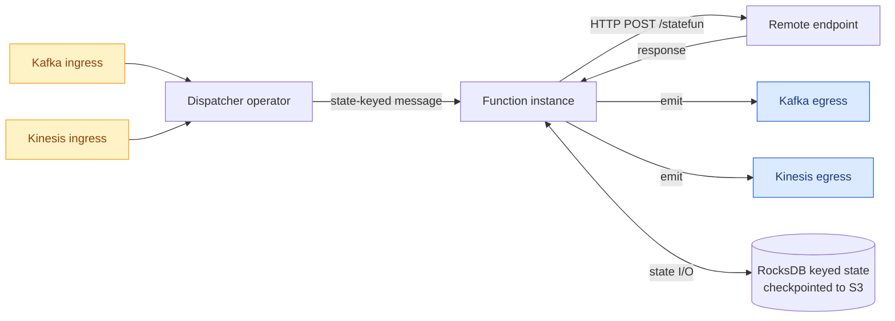
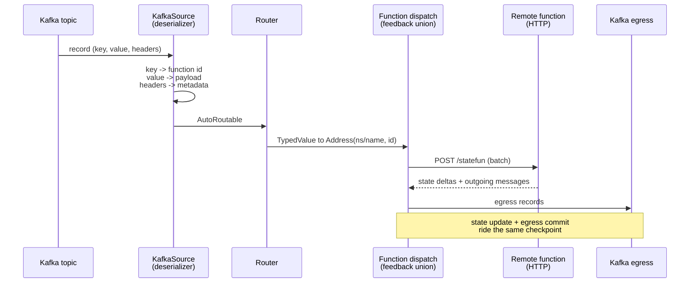

# Architecture

> Stateful Functions runs as a single Apache Flink job. The job dispatches messages to function instances keyed by a logical id, gives each instance per-key durable state, and connects them to ingresses and egresses through Flink operators.

## System view



## Core building blocks

### Function

A **stateful function** is a small piece of logic addressed by `(namespace, name, id)`. Each unique `id` is its own *instance* with private state. Instances aren't all live in memory — Flink loads them on demand by key.

```java
public class GreeterFn implements StatefulFunction {
  static final TypeName TYPE = TypeName.typeNameFromString("example/greeter");

  @Override
  public CompletableFuture<Void> apply(Context ctx, Message msg) {
    // Read your per-instance state, react to the message, optionally emit.
    return ctx.done();
  }
}
```

Functions can be **embedded** (compiled into the StateFun JAR, run inline in the JVM) or **remote** (deployed as an HTTP service in any language; the runtime invokes them per message).

### Dispatcher

The dispatcher is a Flink operator that receives every inbound message, computes the target `Address`, and routes it to the right function instance. Routing is a pure function of the message's namespace, name, and id.

### Ingress and egress

Ingresses are entry points (Kafka, Kinesis, or a custom Flink source). Each ingress declares one or more **routers** that turn raw records into function-addressed messages.

Egresses are sinks. Functions emit egress messages from their handler; the runtime delivers them transactionally with the next checkpoint.

### State

Each function instance has a typed `AddressScopedStorage`:

- Backed by Flink's keyed-state primitives (`ValueState`, `ListState`, `MapState`)
- Stored in **RocksDB** by default — incremental, on-disk
- **Checkpointed** to durable storage (S3, GCS, MinIO) on Flink's checkpoint interval
- Recovered automatically on JobManager failover

You declare state via `ValueSpec`s on the function spec; the runtime gives you a typed handle inside `Context`.

## Message flow

One record's journey through the job, from Kafka partition to egress topic. This is also the map for reasoning about failure: a record that cannot be deserialized fails inside the source (before routing), while a record for an unknown function type fails at dispatch, after it has entered checkpointed state.



Two properties fall out of this picture:

- **The failure unit is the whole job.** Every ingress, function and egress runs in one Flink job; an unhandled error anywhere in the flow restarts everything ([ADR-0007](../adr/0007-restart-strategy-key-names.md), [ADR-0008](../adr/0008-kafka-invalid-record-handling.md)).
- **The record key is the function identity.** The Kafka key becomes the function instance id, which is why keys are mandatory on routable ingresses and why per-key ordering holds end to end.

## Deployment topology

The same code can run in three modes, picked at deployment time:

| Mode | Where the function runs | When to use |
|---|---|---|
| **Embedded** | Inline in the Flink TaskManager JVM | Highest throughput; Java/Scala only; stateful logic that lives with the runtime |
| **Co-located** | Sidecar container next to the TM, IPC over stdio or local HTTP | Low-latency polyglot; deployment coupled to the runtime pod |
| **Remote** | Independent HTTP service, scaled separately | Polyglot, polyrepo, polyteam — the typical microservice pattern |

The Kzmlabs E2E gate exercises the **remote** path because that's the most general. Embedded and co-located are subsets of the same wire protocol.

## Exactly-once

Flink's checkpointing makes the runtime stateful and replayable. The wire protocol between the runtime and a remote function is request-reply: the runtime captures the message, calls the function, applies the state delta and emits any egress messages — all as a single atomic step that participates in the next checkpoint. On JobManager failover, the runtime replays from the last successful checkpoint.

Egress to Kafka uses Kafka transactions; egress to Kinesis uses idempotent producers — both deliver exactly-once when paired with `deliverySemantic.type: exactly-once` in the egress spec.

## Deeper topics

<div class="grid cards" markdown>

- :material-package-variant-closed:{ .lg .middle } &nbsp; **[Shading layer](shading.md)** — how Protobuf is relocated so StateFun and your code can use different versions on the same classpath.
- :material-test-tube:{ .lg .middle } &nbsp; **[End-to-end tests](e2e-tests.md)** — the Kubernetes-native release gate, what it covers, and how to run it locally.
- :material-file-document-check:{ .lg .middle } &nbsp; **[Decision records](../adr/index.md)** — the ADR log: every significant technical decision with its context and consequences.

</div>

## Next steps

<div class="grid cards" markdown>

- :material-server-network:{ .lg .middle } &nbsp; **[Kafka I/O guide](../guides/kafka-io.md)** — wire ingress and egress in `module.yaml`.
- :material-aws:{ .lg .middle } &nbsp; **[Kinesis I/O guide](../guides/kinesis-io.md)** — Flink 2.x Kinesis source/sink specifics.
- :material-kubernetes:{ .lg .middle } &nbsp; **[Deploy on Kubernetes](../guides/k8s-deployment.md)** — production layout via the Flink Operator.

</div>
