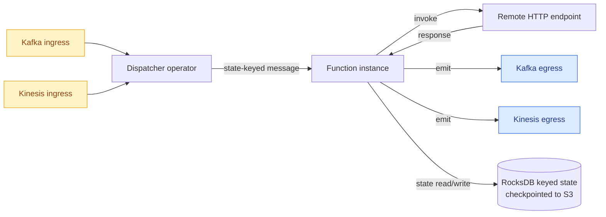

# Architecture

Kzmlabs StateFun is a Flink job composed of:

- A **dispatcher operator** that routes incoming messages to the correct function instance, keyed by `(namespace, name, id)`.
- **Stateful function invocations** — either embedded (run inline in the JVM) or remote (called over HTTP).
- **Per-function state primitives** that read and write Flink keyed state through a typed `AddressScopedStorage` interface.
- **Ingress and egress operators** for Kafka, Kinesis, and Flink-native sources/sinks.

## Deeper topics

- [Shading layer](shading.md) — how Protobuf is relocated to avoid version collisions
- [End-to-end tests](e2e-tests.md) — the K8s-native E2E gate
