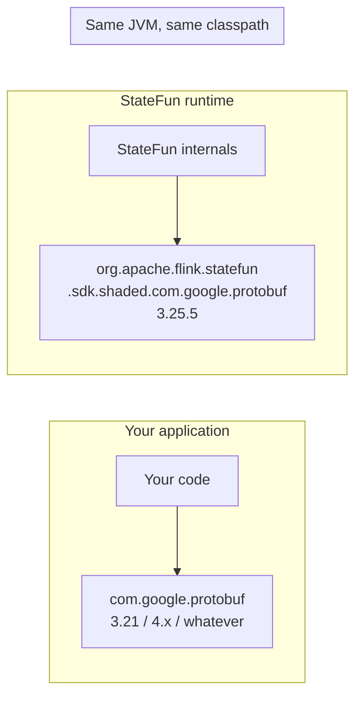

# Shading layer

> StateFun ships a **relocated copy of Protobuf** so it can run on the same classpath as your code regardless of which Protobuf version your code uses. Two `Message` types from the JVM's view, one binary, no `NoSuchMethodError`.

## The problem

StateFun's runtime needs Protobuf 3.25.5 internally. A user's job may already pull a different Protobuf version — 3.21 from an older library, 4.x from a recent dependency, or whatever Flink/Kafka transitively bring. Without isolation, two copies of `com.google.protobuf.Message` end up on the classpath. The JVM picks one, the other breaks at runtime with `NoSuchMethodError` or silent serialization corruption.

## The fix

Two modules under `statefun-shaded/`:

| Module | Contents | Relocated to |
|---|---|---|
| `statefun-protobuf-shaded` | A copy of `protobuf-java` 3.25.5 | `org.apache.flink.statefun.sdk.shaded.com.google.protobuf.*` |
| `statefun-protocol-shaded` | StateFun's generated protocol classes (`Address`, `FromFunction`, `ToFunction`) | Same `org.apache.flink.statefun.sdk.shaded.*` prefix |

StateFun internally imports the relocated names:

```java
import org.apache.flink.statefun.sdk.shaded.com.google.protobuf.Message;  // StateFun's private copy
```

Your code keeps importing the regular names:

```java
import com.google.protobuf.Message;  // your version, untouched
```

The two are distinct classes from the JVM's view. No collision regardless of your Protobuf version.

## Implementation note

Unusually, the relocation happens at **source-generation time** (via `replacer-plugin`), not at JAR-creation time (the more common `maven-shade-plugin <relocations>` pattern). The reason: `statefun-sdk-java` source code itself imports the relocated names. JAR-time relocation would mean those class names only exist after packaging — too late for compile.

Trade-offs:

- One extra build step per shaded module (the source-rewriter)
- Generated `.java` files carry a `@javax.annotation.Generated("proto")` marker
- Slight noise in maven-shade-plugin overlap warnings when uber JARs include both the relocated and original Protobuf JARs (intentional)

The benefit is that downstream modules in the same reactor can compile-time reference the relocated types, which keeps the SDK's public API simple: it speaks Protobuf, internally uses its private copy, externally uses yours.

## What stays unrelocated

- The public SDK API (`statefun-sdk-java`) — so users `import org.apache.flink.statefun.sdk.java.*` directly
- Your function code, your Protobuf types — your imports are unchanged
- Flink's own `flink-shaded-*` artifacts — different relocation, owned by Flink

## Net result

A user can put StateFun on their classpath alongside any Protobuf version they want. StateFun internally uses its private relocated copy; your `com.google.protobuf.Message` is whatever you brought.



## Next steps

<div class="grid cards" markdown>

- :material-graph:{ .lg .middle } &nbsp; **[Architecture overview](index.md)** — how shading fits into the runtime.
- :material-test-tube:{ .lg .middle } &nbsp; **[E2E tests](e2e-tests.md)** — wire-format verification including the relocated protocol types.
- :material-source-branch-sync:{ .lg .middle } &nbsp; **[Migrate from Apache StateFun](../upstream-vs-kzm.md)** — same shading model as upstream; nothing to change.

</div>
