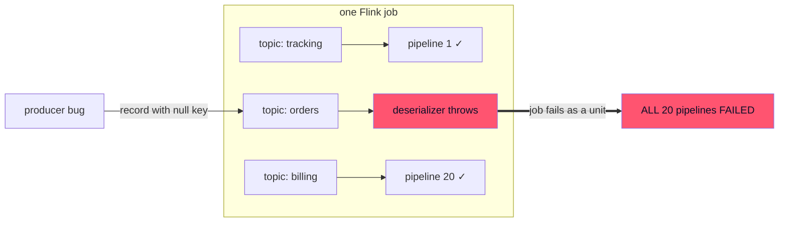
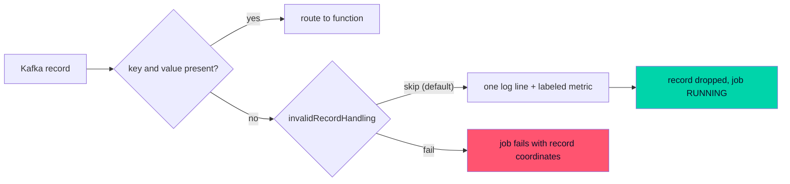

# One bad Kafka record should not kill 20 pipelines

*Published 2026-08-08 · by the kzmlabs maintainers*


!!! abstract "TL;DR"

    One null-key Kafka record used to crash an entire Stateful Functions job - every pipeline, not just the one that read it. As of 3.4.0-KZM-3.5 the routable ingress has an `invalidRecordHandling` policy: `skip` (new default) drops the record, logs it individually with full coordinates and counts it with `topic` + `defect` Prometheus labels; `fail` restores the strict halt-on-bad-data contract, per ingress or per topic.

A while back we did something every streaming team should try once: we took a live Kubernetes cluster running Stateful Functions, and deliberately fed it garbage. One Kafka record with a null key. Then one tombstone. Nothing exotic - the kind of records any misconfigured producer can emit on a Tuesday.

The null key killed the entire Flink job. Not the pipeline that consumed it - all of them. Every ingress, every topic, every function, gone with one `IllegalStateException`.

The tombstone was worse. It sailed past the key check and blew up as a bare `NullPointerException` from `com.google.protobuf.ByteString.wrap`, deep inside envelope building. No topic, no offset, no hint of which record did it. Good luck with that at 3am.



And then it looped: the poison record's offset never gets committed, so every restart re-reads it and dies again, until the restart budget runs out and the job parks itself at terminal `FAILED`.

If you run one topic and one pipeline, maybe that's tolerable. We know teams running twenty topics feeding twenty pipelines in a single StateFun job. One producer bug on one topic, and all twenty stop - order tracking, notifications, billing, everything - because of a record most of them never touched. That's not an engineering nuisance, that's a platform-wide outage with a single-record trigger.

As of [StateFun Actors 3.4.0-KZM-3.5](https://github.com/kzmlabs/flink-statefun/releases/tag/v3.4.0-KZM-3.5), it's no longer the default behavior. Here's what we shipped and, more interesting, what we argued about along the way.

## The fix: a policy, not a crash

`invalidRecordHandling` on the routable Kafka ingress. An ingress-level default, with a per-topic override:

```yaml
kind: io.statefun.kafka.v1/ingress
spec:
  invalidRecordHandling:
    type: skip          # default when omitted
    logLevel: warn      # debug | info | warn | error
  topics:
    - topic: payments.commands
      invalidRecordHandling:
        type: fail      # strict contract for this one topic
      ...
```

`skip` is the new default: the bad record is dropped, the job keeps running, the other nineteen pipelines never notice.

`fail` is the old behavior, one line of yaml away - and it's the right choice more often than the name suggests. Crash-on-first-bad-record is a defensible default for a financial ledger, where a processing gap is worse than downtime. It's a terrible default for everything else. The per-topic override exists precisely so one ingress can hold both: lenient telemetry topics next to a strict billing topic.



## The argument we had about rate limiting

The original design had a log rate limiter: first occurrence per (topic, defect) logs fully, repeats get summarized into periodic count lines. Very reasonable. Very standard.

We threw it out.

When a producer misbehaves, the operator's first question is "which records, exactly?" - and a summarized log can't answer it. So every skipped record gets exactly one line, with everything you need to point at the guilty producer:

```text
Skipping invalid record: defect [NULL_KEY], topic [orders], partition [0], offset [42], timestamp [1690000000123], key [null], value size [17]
```

Flood protection is real, but that's what the counters are for. Logs answer "which records"; metrics answer "how many, how fast, alert whom." Two counters land on the source operator (inside the `deserializer` scope KafkaSource hands to the deserialization schema - more on that below):

- `numInvalidRecordsSkipped` - the total for the ingress
- `topic.<topic>.defect.<NULL_KEY|NULL_VALUE>.numInvalidRecordsSkipped` - the same count with `topic` and `defect` as Prometheus labels

That labeled counter is the one you alert on: the alert that fires literally names the topic and the kind of corruption. Ready-made rules are in the [Alerting guide](../guides/alerting.md).

Under `fail` you still crash - but now the exception carries the full coordinates too, tombstones included. The forensic hunt is over either way.

## The metric we deliberately did NOT ship

An earlier revision also incremented `numRecordsInErrors`, the FLIP-33 standard source counter, "so existing dashboards pick up the signal unchanged." Sounds great in a design doc.

Then a review pass against the actual `flink-connector-kafka` bytecode showed the deserialization schema never gets the operator I/O metric group - KafkaSource hands it a `deserializer` subgroup. The real FLIP-33 counter is simply unreachable from there. Registering a same-named counter in a different scope would have produced a metric that looks standard, shows up in searches, and quietly measures something else. Dashboards would have trusted it.

So it's gone, and the docs say why. If you take one thing from this section: when a doc claims "existing dashboards will just work," check which metric group the code actually writes to.

## An accidental fix, five years late

`KafkaIngressDeserializer`'s javadoc has said "return null if the message cannot be deserialized" for years. The runtime never honored it - the null went straight into Flink's collector and corrupted the stream. Classic case of documentation describing the intended world, not the real one.

The skip mechanism is exactly "deserializer returns null, runtime counts and drops it" - so that contract is now real for every deserializer, including custom embedded-SDK ones. If your custom deserializer returns null today, those records now get skipped instead of taking the job down. Check your assumptions before upgrading; it's in the changelog as a behavioral break.

## How does this compare to a dead letter queue?

Prior art worth naming, because the ecosystem solved this at other layers long ago:

- **Kafka Connect** has `errors.tolerance: all` plus a dead letter topic - protects connectors, not stream processors.
- **Kafka Streams** has `DeserializationExceptionHandler` with the stock `LogAndContinueExceptionHandler` - the closest analog to our `skip`, though without pinned per-record coordinates or the per-topic/per-defect metric breakdown.
- **Flink DataStream** jobs route bad records to side outputs - but StateFun users never touch the DataStream API, which is exactly why the ingress itself has to own the policy.

`skip` is our log-and-continue layer. The true dead-letter layer - `forward`, delivering invalid records to a designated function with provenance metadata so you can quarantine or replay them with the full programming model - is designed (ADR-0008 in the repository) and is the next stage. The handler abstraction is already in place, so it lands without touching the ingress hot path.

## Proof over promises

Every release of this fork is gated on a Kubernetes-native E2E suite - real Flink Operator, real Kafka, real remote functions, provisioned in CI from scratch. The invalid-record scenarios run against a dedicated deployment in that suite: poison records under `skip` (job must stay `RUNNING`, the next valid record must come out the other side, every skip must appear in the TaskManager log), and the same poison under `fail` (job must die with coordinates in the JobManager log).

Getting those tests green was its own small saga - an application-mode JobManager exits after a terminal job failure, and its pod restart takes the logs we were asserting on with it. If you ever wonder why your `kubectl logs` shows a suspiciously fresh JobManager after a crash: that's why. `execution.shutdown-on-application-finish: false` is your friend in test rigs.

The failure mode this feature fixes was discovered by poking a live cluster. The fix is proven the same way, on every commit. That's the standard we're trying to hold this fork to.

---

**Try it:** [Kafka I/O guide](../guides/kafka-io.md#invalid-records) covers the full configuration, [Metrics](../guides/metrics.md) and [Alerting](../guides/alerting.md) the observability. The repository is [github.com/kzmlabs/flink-statefun](https://github.com/kzmlabs/flink-statefun); StateFun Actors is the maintained fork of Apache Stateful Functions on Flink 2.2 and Java 21 - the story of the fork is in [Why we forked](forking-statefun.md).
