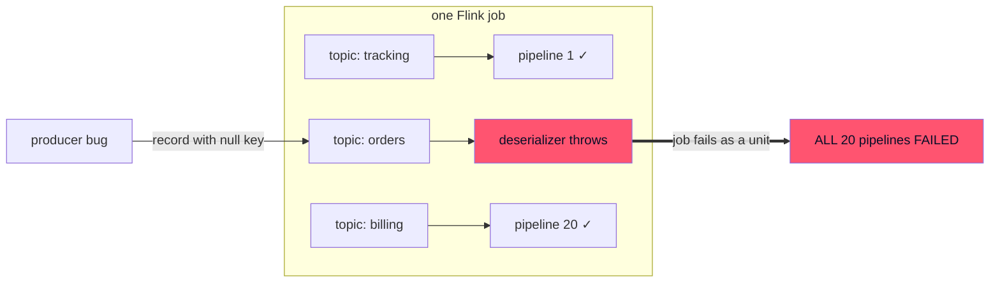
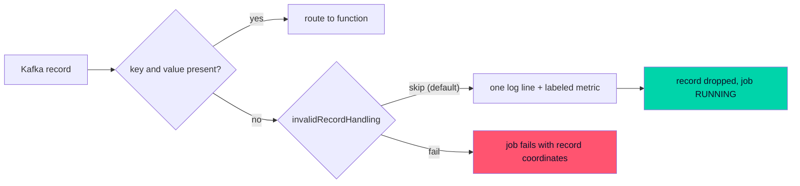

# One bad Kafka record should not kill 20 pipelines

*Published 2026-08-08 · by the kzmlabs maintainers*


!!! abstract "TL;DR"

    One null-key Kafka record used to crash an entire Stateful Functions job - every pipeline, not just the one that read it. As of 3.4.0-KZM-3.5 the routable ingress has an `invalidRecordHandling` policy: `skip` (new default) drops the record, logs it individually with full coordinates and counts it with `topic` + `defect` Prometheus labels; `fail` restores the strict halt-on-bad-data contract, per ingress or per topic.

Picture a delivery platform. Ten thousand orders in flight, each one an event on a Kafka topic, each topic feeding a Stateful Functions pipeline: order tracking, courier assignment, notifications, billing. Twenty topics, twenty pipelines, one Flink job.

Now one producer publishes a single malformed order event: a record with no key.

In Apache Stateful Functions, that one record crashed the entire job. Not the one pipeline that consumed it - all twenty. Order tracking down, couriers idle, customers refreshing the app. One bad record, platform-wide outage.

As of [StateFun Actors 3.4.0-KZM-3.5](https://github.com/kzmlabs/flink-statefun/releases/tag/v3.4.0-KZM-3.5), that is no longer the default behavior. This article walks through what actually happened inside the runtime, why it was a business problem rather than an engineering nuisance, and what the `invalidRecordHandling` policy does about it.

## What actually happens on a bad record?

The routable Kafka ingress (`io.statefun.kafka.v1/ingress`) uses the record key as the target function instance id, and the record value as the message payload. Two kinds of records violate that contract:

- **Null key.** There is no function instance to route to. The deserializer threw an `IllegalStateException`.
- **Null value (tombstone).** Compacted topics use null-valued records as deletion markers. The deserializer passed the null payload into envelope building and died with a bare `NullPointerException` from deep inside protobuf - no topic, no offset, no hint which record was responsible.

We verified both empirically on a live Kubernetes cluster before changing anything: produce one poison record, watch the whole job go down. Because a Flink job fails as a unit, the blast radius is every ingress, every topic, every function - not just the pipeline that consumed the record:



Worse, the failure loops. The offset of the poison record is never committed, so every restart re-reads it and dies again, until the restart budget is exhausted and the job reaches terminal `FAILED`.

## Why this is a business problem

The record that kills the job is, by definition, the record nobody planned for: a producer bug, a manual publish gone wrong, a tombstone landing on a topic that was never supposed to be compacted. It arrives unannounced, usually at night.

The cost structure is what makes it painful. The trigger is one event, but the outage is total: with twenty topics feeding twenty pipelines, one bad record on one topic halts all twenty. Revenue-carrying traffic stops because of a record it never touched. Recovery is manual - someone has to find the poison record (with no diagnostics pointing at it), skip past it by hand, and restart the job.

## The fix: a policy, not a crash

`invalidRecordHandling` is a per-ingress setting with a per-topic override:

```yaml
kind: io.statefun.kafka.v1/ingress
spec:
  invalidRecordHandling:
    type: skip          # default when omitted
    logLevel: warn      # debug | info | warn | error
  topics:
    - topic: payments.commands
      invalidRecordHandling:
        type: fail      # strict contract for this one topic
      ...
```

**`type: skip` is the new default.** An invalid record is dropped and the job keeps running. The other nineteen pipelines never notice.

**`type: fail` restores the strict contract.** Some pipelines should halt on bad data - regulated flows, financial commands, anything where processing gap is worse than downtime. One line of yaml, per ingress or per topic.



## Is a skipped record silently lost?

No - and this is the part that matters operationally. Every skipped record produces one log line with full coordinates:

```text
Skipping invalid record: defect [NULL_KEY], topic [orders], partition [0], offset [42], timestamp [1690000000123], key [null], value size [17]
```

There is deliberately no rate limiting. During the design review we chose per-record diagnosability over log-flood protection: when a producer misbehaves, the operator's first question is "which records, exactly?" and sampled or summarized logs cannot answer it. The counters absorb the alerting load instead.

Two counters register on the source operator, inside the `deserializer` scope:

- `numInvalidRecordsSkipped` - the total across all topics of the ingress.
- `topic.<topic>.defect.<NULL_KEY|NULL_VALUE>.numInvalidRecordsSkipped` - the same count broken down with `topic` and `defect` as Prometheus labels.

The labeled counter is the workhorse: the alert that fires carries the topic name and the defect kind, so it points at the misbehaving producer directly. Ready-made alert rules are in the [Alerting guide](../guides/alerting.md).

## What happens under fail?

The job fails on the first invalid record - but unlike the old behavior, the exception carries the full record coordinates:

```text
The io.statefun.kafka.v1/ingress ingress cannot process a tombstone (null value) record. Offending record: topic [orders], partition [0], offset [42], timestamp [1690000000123], key [order-17].
```

The tombstone case previously surfaced as a bare `NullPointerException` with no context at all. Under `fail` you still get the halt-on-bad-data guarantee; you no longer get the forensic hunt.

## How do we know it works?

Every release of StateFun Actors is gated on a Kubernetes-native end-to-end suite: a real Flink Kubernetes Operator, real Kafka, real remote functions, provisioned in CI from scratch. The invalid-record scenarios run against a dedicated deployment in that suite:

- Under the default skip policy: a null-key poison record and a tombstone are produced, followed by a valid record. The test asserts the job stays `RUNNING`, the valid record's result arrives, and the TaskManager log carries one diagnostic line per skipped record.
- Under `fail`: the same poison records must fail the job with the coordinates in the JobManager log.

The failure mode this feature fixes was itself discovered by poking a live cluster; the fix is proven the same way, on every commit.

## What about custom deserializers?

`KafkaIngressDeserializer` has documented "return null if the message cannot be deserialized" in its javadoc for years - but the runtime never honored it and collected the null anyway. As of this release the contract is real for every deserializer, including custom embedded-SDK ones: a null return counts and drops the record instead of corrupting the stream. If your custom deserializer returns null today, its records will now be skipped instead of crashing the job.

## How does this compare to a dead letter queue?

Different layers of the same defense, and the ecosystem has several prior arts worth naming:

- **Kafka Connect** routes failed records to a dead letter topic via `errors.tolerance: all` and `errors.deadletterqueue.topic.name`. That protects connectors, not stream processors.
- **Kafka Streams** has `DeserializationExceptionHandler` with the stock `LogAndContinueExceptionHandler` - the closest analog to our `skip`, though without per-record coordinates in a pinned format or a per-topic, per-defect metric breakdown.
- **Flink DataStream** jobs typically route bad records to a side output. Stateful Functions users never see the DataStream API, so that escape hatch was out of reach - which is exactly why the ingress itself has to own the policy.

`skip` is the log-and-continue layer. The planned `forward` policy (ADR-0008 stage 3) is the true dead-letter layer: invalid records delivered to a designated function with provenance metadata, so a pipeline can quarantine, replay or alert on them with the full power of the programming model.

## When should you keep type: fail?

Use `fail` where a processing gap is worse than downtime: payment commands, ledger events, anything audited. Use the default `skip` everywhere availability wins. The per-topic override means one ingress can hold both: lenient telemetry topics next to a strict billing topic.

## What is next

`type: forward` - delivering invalid records to a dead-letter function with provenance metadata - is designed (ADR-0008 in the repository) and lands as the next stage. The handler abstraction is already in place, so it arrives without touching the ingress hot path.

---

**Try it:** [Kafka I/O guide](../guides/kafka-io.md#invalid-records) covers the full configuration, [Metrics](../guides/metrics.md) and [Alerting](../guides/alerting.md) the observability. The repository is [github.com/kzmlabs/flink-statefun](https://github.com/kzmlabs/flink-statefun); StateFun Actors is the maintained fork of Apache Stateful Functions on Flink 2.2 and Java 21 - the story of the fork is in [Why we forked](forking-statefun.md).
