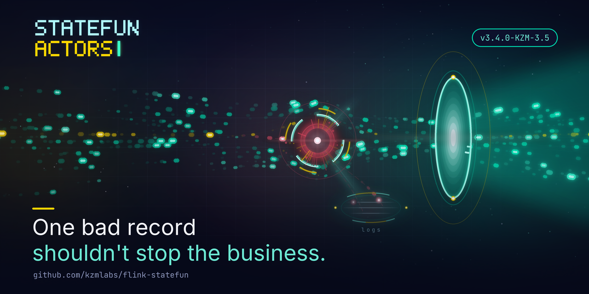
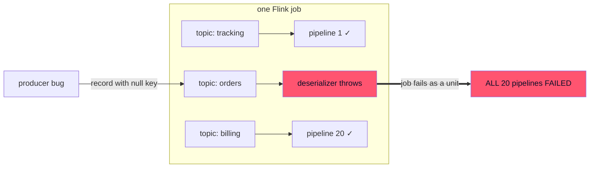

# One bad Kafka record should not kill 20 pipelines

*Published 2026-08-08 · by the kzmlabs maintainers*



## What was broken

In Apache Stateful Functions, the routable Kafka ingress had no policy for malformed records. A record with a **null key** (there's no function instance to route to) threw inside the deserializer. A **tombstone** (null value, normal on compacted topics) blew up as a bare `NullPointerException` from deep inside protobuf - no topic, no offset, no hint which record did it.

Either way the whole Flink job died - every ingress, every topic, every function, not just the pipeline that read the record. And it looped: the poison record's offset is never committed, so each restart re-reads it and dies again until the job parks at terminal `FAILED`.

With twenty topics feeding twenty pipelines in one job, one producer bug on one topic halts all twenty.



## What ships in 3.4.0-KZM-3.5

[StateFun Actors 3.4.0-KZM-3.5](https://github.com/kzmlabs/flink-statefun/releases/tag/v3.4.0-KZM-3.5) adds `invalidRecordHandling` to `io.statefun.kafka.v1/ingress`:

```yaml
kind: io.statefun.kafka.v1/ingress
spec:
  id: example/orders
  address: kafka.svc:9092
  invalidRecordHandling:
    type: skip              # default when omitted
    logLevel: warn          # debug | info | warn | error
  topics:
    - topic: example.orders
      valueType: example/Order
      targets:
        - example/order-handler
    - topic: payments.commands
      valueType: example/PaymentCommand
      invalidRecordHandling:
        type: fail          # per-topic override: strict contract here
      targets:
        - example/payment-handler
```

**`type: skip` - the new default.** The invalid record is dropped and the job keeps running. Nothing is silently lost:

- one log line per skipped record, with full coordinates:

    ```text
    Skipping invalid record: defect [NULL_KEY], topic [orders], partition [0], offset [42], timestamp [1690000000123], key [null], value size [17]
    ```

- counters on the source operator: `numInvalidRecordsSkipped` (total) and `topic.<topic>.defect.<NULL_KEY|NULL_VALUE>.numInvalidRecordsSkipped` - with the Prometheus reporter, `topic` and `defect` arrive as labels, so the alert names the misbehaving producer and the kind of corruption directly. Ready-made rules: [Alerting guide](../guides/alerting.md).

**`type: fail` - the strict contract.** The job still halts on the first invalid record - right for ledgers and payment commands, where a processing gap is worse than downtime - but the exception now carries the full record coordinates, tombstones included. No more forensic hunt.

## Flexibility

- Policy per **ingress** (default for all its topics) with a wholesale per-**topic** override - one ingress can run lenient telemetry topics next to a strict billing topic.
- Skip log level per ingress or per topic: `debug | info | warn (default) | error`.
- Deliberately **no rate limiting** on skip logs: when a producer misbehaves, "which records exactly?" must be answerable from the log. Alerting load belongs to the labeled counters.

## Upgrading

- **Behavioral break:** the default flips from crash-the-job to skip-with-log+metric. If your team alerts on job restarts as the bad-data signal, move that alert to `numInvalidRecordsSkipped` - or pin `type: fail` to keep the old behavior.
- Custom `KafkaIngressDeserializer` implementations: a `null` return now skips the record (the long-documented javadoc contract is finally enforced) instead of crashing the job.
- Coordinates: Maven `io.github.kzmlabs.flinkstatefun:*:3.4.0-KZM-3.5`, image `ghcr.io/kzmlabs/flink-statefun:3.4.0-KZM-3.5`.

## What's next

`type: forward` - delivering invalid records to a dead-letter function with provenance metadata (topic, partition, offset, defect) so pipelines can quarantine or replay them - is designed in ADR-0008 and is the next stage.

---

**Docs:** [Kafka I/O - invalid records](../guides/kafka-io.md#invalid-records) · [Metrics](../guides/metrics.md) · [Alerting](../guides/alerting.md). **Repo:** [github.com/kzmlabs/flink-statefun](https://github.com/kzmlabs/flink-statefun) - StateFun Actors is the maintained fork of Apache Stateful Functions on Flink 2.2 / Java 21 ([why we forked](forking-statefun.md)).
