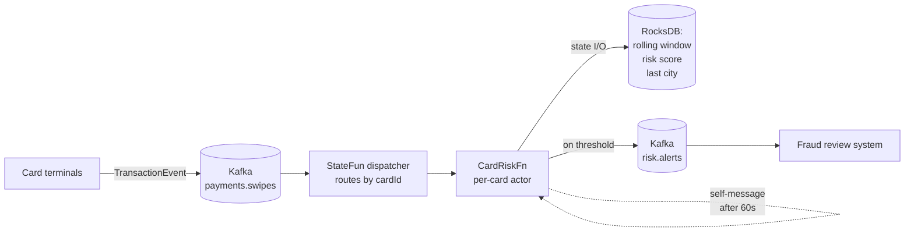

# Real-time fraud detection

> A per-card actor that scores every swipe in real time. Velocity, geo-impossibility, and amount-anomaly checks against a rolling window. Alerts fire only on threshold breach. Built in 200 lines of Java.

## The problem

You receive card-swipe events on a Kafka topic. For each card, you need to:

1. Maintain a **rolling window** of the last N transactions
2. Detect:
    - **Velocity**: >3 transactions in 60 seconds
    - **Geo-impossibility**: two transactions in different cities < 10 minutes apart
    - **Amount anomaly**: a transaction >5σ above the card's running average
3. Emit a `RiskAlert` to a downstream topic only when one of those triggers fires
4. Decay risk back to baseline if no events arrive for a while

Doing this with a relational DB doesn't scale: every swipe needs read-modify-write on the card row, contention destroys you above ~5k TPS. Doing it with a Flink job means writing windowed state primitives by hand. **A StateFun per-card actor gives you both per-key state isolation and exactly-once messaging without the boilerplate.**

## Architecture



Each `cardId` is its own actor instance, scaled across TaskManager slots. The actor reads its own state, runs the three checks, and either falls through silently or emits a `RiskAlert`.

## Message types

```protobuf
// payments.proto
syntax = "proto3";
package kzmlabs.example.payments;

message TransactionEvent {
  string card_id     = 1;
  double amount_usd  = 2;
  string city        = 3;
  string country     = 4;
  int64  timestamp   = 5;  // millis since epoch
  string merchant    = 6;
}

message RiskAlert {
  string card_id        = 1;
  string trigger        = 2;  // "velocity" | "geo_impossible" | "amount_anomaly"
  double risk_score     = 3;
  TransactionEvent event = 4;
  string explanation    = 5;
}
```

## Function implementation

```java
// CardRiskFn.java
package com.kzmlabs.example.payments;

import java.time.Duration;
import java.util.*;
import java.util.concurrent.CompletableFuture;
import org.apache.flink.statefun.sdk.java.*;
import org.apache.flink.statefun.sdk.java.io.KafkaEgressMessage;
import org.apache.flink.statefun.sdk.java.message.Message;
import com.kzmlabs.example.payments.PaymentsProto.*;

public class CardRiskFn implements StatefulFunction {

  public static final TypeName FN_TYPE   = TypeName.typeNameFromString("payments/card-risk");
  public static final TypeName ALERT_OUT = TypeName.typeNameFromString("payments/risk-alerts");

  // ─── Per-card state ─────────────────────────────────────────────
  public static final ValueSpec<RollingWindow> WINDOW =
      ValueSpec.named("window").withCustomType(Types.rollingWindow());
  public static final ValueSpec<Double>  RISK_SCORE = ValueSpec.named("risk").withDoubleType();
  public static final ValueSpec<String>  LAST_CITY  = ValueSpec.named("city").withUtf8StringType();
  public static final ValueSpec<Long>    LAST_SEEN  = ValueSpec.named("seen").withLongType();

  // Tunables
  private static final int    WINDOW_SIZE        = 20;
  private static final long   VELOCITY_WINDOW_MS = 60_000;
  private static final int    VELOCITY_THRESHOLD = 3;
  private static final long   GEO_WINDOW_MS      = 600_000;
  private static final double AMOUNT_SIGMA       = 5.0;
  private static final double ALERT_THRESHOLD    = 0.7;

  @Override
  public CompletableFuture<Void> apply(Context ctx, Message msg) {
    if (!msg.is(Types.TX_EVENT_TYPE)) return ctx.done();

    TransactionEvent tx = msg.as(Types.TX_EVENT_TYPE);
    AddressScopedStorage state = ctx.storage();

    // 1. Update the rolling window
    RollingWindow window = state.get(WINDOW).orElseGet(RollingWindow::empty);
    window.add(tx, WINDOW_SIZE);
    state.set(WINDOW, window);
    state.set(LAST_SEEN, tx.getTimestamp());

    // 2. Run checks
    String trigger = null;
    String explanation = null;

    if (window.countWithin(VELOCITY_WINDOW_MS, tx.getTimestamp()) > VELOCITY_THRESHOLD) {
      trigger = "velocity";
      explanation = "more than " + VELOCITY_THRESHOLD + " transactions in 60s";
    } else if (state.get(LAST_CITY).filter(prev -> !prev.equals(tx.getCity())).isPresent()
        && window.last().getTimestamp() - tx.getTimestamp() > -GEO_WINDOW_MS) {
      trigger = "geo_impossible";
      explanation = "moved from " + state.get(LAST_CITY).get() + " to " + tx.getCity()
          + " within 10 minutes";
    } else if (window.amountIsOutlier(tx.getAmountUsd(), AMOUNT_SIGMA)) {
      trigger = "amount_anomaly";
      explanation = "amount " + tx.getAmountUsd() + " > 5σ above rolling avg";
    }

    state.set(LAST_CITY, tx.getCity());

    // 3. Update risk score (additive on hit, exponential decay on miss)
    double currentRisk = state.get(RISK_SCORE).orElse(0.0);
    double nextRisk = trigger != null
        ? Math.min(1.0, currentRisk + 0.4)
        : currentRisk * 0.95;
    state.set(RISK_SCORE, nextRisk);

    // 4. Emit alert only on threshold breach
    if (trigger != null && nextRisk > ALERT_THRESHOLD) {
      RiskAlert alert = RiskAlert.newBuilder()
          .setCardId(tx.getCardId())
          .setTrigger(trigger)
          .setRiskScore(nextRisk)
          .setEvent(tx)
          .setExplanation(explanation)
          .build();

      ctx.send(KafkaEgressMessage.forEgress(ALERT_OUT)
          .withTopic("risk.alerts")
          .withKey(tx.getCardId())
          .withValue(alert.toByteArray())
          .build());
    }

    // 5. Schedule a self-tick to decay risk if quiet for 60 s
    ctx.sendAfter(
        Duration.ofMinutes(1),
        Message.builder()
            .withTargetAddress(ctx.self())
            .withCustomType(Types.QUIET_TICK_TYPE, new QuietTick(tx.getTimestamp()))
            .build());

    return ctx.done();
  }
}
```

The actor is **stateful**, **per-card**, and **reactive** — it never polls, never queries an external store, and the JVM only holds the state for cards currently being touched. Inactive cards are paged out automatically by Flink's keyed-state.

## Wiring

```yaml
# module.yaml
kind: io.statefun.endpoints.v2/http
spec:
  functions: payments/*
  urlPathTemplate: http://payments-functions.svc:8080/statefun

---
kind: io.statefun.kafka.v1/ingress
spec:
  id: payments/swipes
  address: kafka.svc:9092
  consumerGroupId: payments-card-risk
  startupPosition: { type: latest }
  topics:
    - topic: payments.swipes
      valueType: kzmlabs.example.payments/TransactionEvent
      targets:
        - payments/card-risk

---
kind: io.statefun.kafka.v1/egress
spec:
  id: payments/risk-alerts
  address: kafka.svc:9092
  deliverySemantic:
    type: exactly-once
    transactionTimeoutMillis: 60000
```

That's the entire deployment configuration. Three blocks, twenty-five lines.

## Testing locally

With the [quickstart stack](../quickstart.md) running, send a synthetic burst:

```bash
for i in $(seq 1 5); do
  echo "card-42:{\"card_id\":\"card-42\",\"amount_usd\":12.50,\"city\":\"Berlin\",\"country\":\"DE\",\"timestamp\":$(date +%s%3N),\"merchant\":\"shop\"}" \
    | docker exec -i statefun-kafka kafka-console-producer \
        --broker-list localhost:9092 --topic payments.swipes \
        --property "parse.key=true" --property "key.separator=:"
  sleep 0.1
done
```

Watch the alerts:

```bash
docker exec statefun-kafka kafka-console-consumer \
  --bootstrap-server localhost:9092 \
  --topic risk.alerts --from-beginning
```

After the fourth swipe within a second, the velocity rule fires and you see a `RiskAlert{trigger: "velocity"}` on the egress topic.

## Production notes

| Concern | Approach |
|---|---|
| **Throughput** | Single TaskManager handles ~50k swipes/s with this code. Scale parallelism = number of partitions on `payments.swipes`. |
| **Hot cards** | A single high-volume card (corporate fleet card, payment aggregator) is one actor → one TaskManager slot. If a card is genuinely 10× the median, partition the keyspace by `(cardId, hash % 4)` and shard the actor. |
| **State size** | RollingWindow of 20 txns ≈ 2 KB. 100M cards × 2 KB = 200 GB on RocksDB — fits easily on a TM with NVMe local disk + S3 incremental checkpoints. |
| **Window decay** | The self-message tick keeps risk decaying even when a card goes quiet. Without it, a once-flagged card would stay risky forever. |
| **Replay safety** | Exactly-once Kafka egress means re-running from a checkpoint produces the same alerts — no duplicate alerts during JM failover. |
| **Cold start** | New cards skip checks until the window has ≥5 txns; bootstrap from historical data via the [Flink State Processor API](https://nightlies.apache.org/flink/flink-docs-stable/docs/libs/state_processor_api/) if you need warm state on day one. |

## Next steps

<div class="grid cards" markdown>

- :material-chip:{ .lg .middle } &nbsp; **[IoT fleet digital twins](iot-fleet.md)** — same actor pattern, different domain.
- :material-server-network:{ .lg .middle } &nbsp; **[Kafka I/O reference](../guides/kafka-io.md)** — exactly-once semantics, partition routing, custom types.
- :material-kubernetes:{ .lg .middle } &nbsp; **[Production deployment](../guides/k8s-deployment.md)** — Flink Operator + RocksDB + S3 checkpoint layout.
- :material-graph:{ .lg .middle } &nbsp; **[Architecture overview](../architecture/index.md)** — what's happening inside the runtime.

</div>
