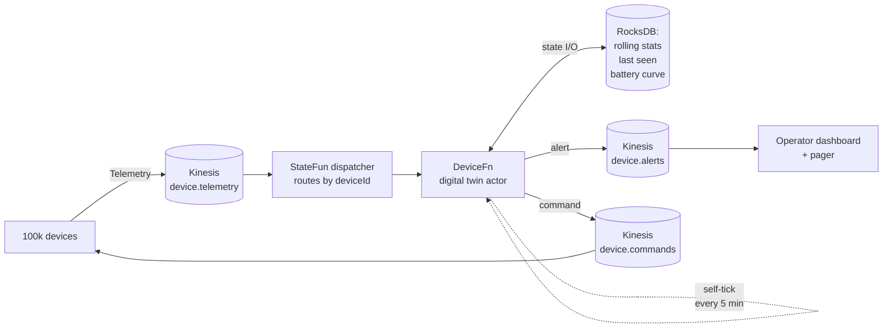

# IoT fleet digital twins

> A per-device twin actor for industrial fleet telemetry. Rolling sensor stats, battery degradation alerts, temperature anomaly detection, offline detection via timers, and command emission back to the device. The full pattern in 250 lines.

## The problem

You operate 100 000 industrial assets — cold-chain trucks, agricultural drones, smart meters, whatever. Each device publishes telemetry every 10 s on a Kinesis stream. You need to:

1. Maintain a **digital twin** for each device — its last known state, rolling stats, health score
2. Detect:
    - **Battery degradation**: drops > 10 %/hour while idle
    - **Temperature spike**: reading > device-specific threshold for 3 consecutive samples
    - **Offline**: no heartbeat for 5 minutes
3. Emit **commands** back to the device on alert (cool down, reduce duty cycle, ping)
4. Expose the latest twin state for an operator dashboard

A relational DB updates per device get expensive at this scale (100k devices × 6 updates/min = 600k writes/min). Time-series DBs handle the writes but make per-device anomaly logic awkward. **A StateFun per-device actor gives you the twin, the anomaly logic, the command channel, and exactly-once delivery in one runtime.**

## Architecture



Each `deviceId` is its own actor. The actor processes telemetry, runs anomaly checks, emits alerts and commands, and self-ticks to detect offline status.

## Message types

```protobuf
// fleet.proto
syntax = "proto3";
package kzmlabs.example.fleet;

message Telemetry {
  string device_id   = 1;
  int64  timestamp   = 2;        // millis since epoch
  double temperature_c = 3;
  double battery_pct = 4;
  double cpu_load    = 5;
  string location    = 6;        // "lat,lon"
  string firmware    = 7;
}

message DeviceAlert {
  string device_id   = 1;
  string trigger     = 2;        // "battery_drop" | "temp_spike" | "offline"
  string severity    = 3;        // "info" | "warning" | "critical"
  string explanation = 4;
  Telemetry last     = 5;
  int64  timestamp   = 6;
}

message DeviceCommand {
  string device_id   = 1;
  string command     = 2;        // "cool_down" | "reduce_duty" | "ping" | "reboot"
  string parameters  = 3;        // JSON
  int64  timestamp   = 4;
}

message OfflineCheck {
  int64 last_seen = 1;
}
```

## Function implementation

```java
// DeviceFn.java
package com.kzmlabs.example.fleet;

import java.time.Duration;
import java.util.concurrent.CompletableFuture;
import org.apache.flink.statefun.sdk.java.*;
import org.apache.flink.statefun.sdk.java.io.KinesisEgressMessage;
import org.apache.flink.statefun.sdk.java.message.Message;
import com.kzmlabs.example.fleet.FleetProto.*;

public class DeviceFn implements StatefulFunction {

  public static final TypeName FN_TYPE   = TypeName.typeNameFromString("fleet/device");
  public static final TypeName ALERT_OUT = TypeName.typeNameFromString("fleet/alerts");
  public static final TypeName CMD_OUT   = TypeName.typeNameFromString("fleet/commands");

  // ─── Per-device twin state ──────────────────────────────────────
  public static final ValueSpec<RollingStats> STATS =
      ValueSpec.named("stats").withCustomType(Types.rollingStats());
  public static final ValueSpec<BatteryCurve> BATTERY =
      ValueSpec.named("battery").withCustomType(Types.batteryCurve());
  public static final ValueSpec<Double> TEMP_THRESHOLD =
      ValueSpec.named("tempThreshold").withDoubleType();
  public static final ValueSpec<Long>   LAST_SEEN  = ValueSpec.named("lastSeen").withLongType();
  public static final ValueSpec<Integer> SPIKE_RUN = ValueSpec.named("spikeRun").withIntType();

  // Tunables
  private static final double BATTERY_DROP_PCT_PER_HOUR = 10.0;
  private static final int    SPIKE_CONSECUTIVE         = 3;
  private static final long   OFFLINE_THRESHOLD_MS      = 5 * 60_000;

  @Override
  public CompletableFuture<Void> apply(Context ctx, Message msg) {

    // ───── Telemetry ingress ──────────────────────────────────────
    if (msg.is(Types.TELEMETRY_TYPE)) {
      Telemetry t = msg.as(Types.TELEMETRY_TYPE);
      AddressScopedStorage s = ctx.storage();

      // Update twin state
      RollingStats stats = s.get(STATS).orElseGet(RollingStats::empty);
      stats.add(t);
      s.set(STATS, stats);
      s.set(LAST_SEEN, t.getTimestamp());

      BatteryCurve battery = s.get(BATTERY).orElseGet(BatteryCurve::empty);
      battery.observe(t.getTimestamp(), t.getBatteryPct());
      s.set(BATTERY, battery);

      double threshold = s.get(TEMP_THRESHOLD).orElse(60.0);

      // 1. Battery degradation
      double dropPerHour = battery.dropPerHour();
      if (dropPerHour > BATTERY_DROP_PCT_PER_HOUR && t.getCpuLoad() < 0.3) {
        emitAlert(ctx, t, "battery_drop", "warning",
            "battery dropping " + String.format("%.1f", dropPerHour) + "%/h while idle");
      }

      // 2. Temperature spike (3 consecutive samples above threshold)
      int spike = s.get(SPIKE_RUN).orElse(0);
      spike = t.getTemperatureC() > threshold ? spike + 1 : 0;
      s.set(SPIKE_RUN, spike);

      if (spike >= SPIKE_CONSECUTIVE) {
        emitAlert(ctx, t, "temp_spike", "critical",
            "temperature " + t.getTemperatureC() + "°C above " + threshold + " for "
                + spike + " samples");
        emitCommand(ctx, t.getDeviceId(), "cool_down", "{\"target_c\":" + (threshold - 5) + "}");
        s.set(SPIKE_RUN, 0);
      }

      // 3. Schedule an offline check
      ctx.sendAfter(
          Duration.ofMillis(OFFLINE_THRESHOLD_MS),
          Message.builder()
              .withTargetAddress(ctx.self())
              .withCustomType(Types.OFFLINE_CHECK_TYPE,
                  OfflineCheck.newBuilder().setLastSeen(t.getTimestamp()).build())
              .build());

      return ctx.done();
    }

    // ───── Offline check (self-message after OFFLINE_THRESHOLD_MS) ─
    if (msg.is(Types.OFFLINE_CHECK_TYPE)) {
      OfflineCheck check = msg.as(Types.OFFLINE_CHECK_TYPE);
      long lastSeen = ctx.storage().get(LAST_SEEN).orElse(0L);

      if (lastSeen == check.getLastSeen()) {
        // No new telemetry arrived during the window → device is offline
        Telemetry empty = Telemetry.newBuilder()
            .setDeviceId(ctx.self().id())
            .setTimestamp(System.currentTimeMillis())
            .build();
        emitAlert(ctx, empty, "offline", "warning", "no heartbeat for 5+ minutes");
      }
      return ctx.done();
    }

    return ctx.done();
  }

  // ─── Helpers ───────────────────────────────────────────────────

  private static void emitAlert(Context ctx, Telemetry t, String trigger, String severity, String why) {
    DeviceAlert a = DeviceAlert.newBuilder()
        .setDeviceId(t.getDeviceId())
        .setTrigger(trigger)
        .setSeverity(severity)
        .setExplanation(why)
        .setLast(t)
        .setTimestamp(System.currentTimeMillis())
        .build();

    ctx.send(KinesisEgressMessage.forEgress(ALERT_OUT)
        .withStream("device.alerts")
        .withPartitionKey(t.getDeviceId())
        .withValue(a.toByteArray())
        .build());
  }

  private static void emitCommand(Context ctx, String deviceId, String cmd, String params) {
    DeviceCommand c = DeviceCommand.newBuilder()
        .setDeviceId(deviceId)
        .setCommand(cmd)
        .setParameters(params)
        .setTimestamp(System.currentTimeMillis())
        .build();

    ctx.send(KinesisEgressMessage.forEgress(CMD_OUT)
        .withStream("device.commands")
        .withPartitionKey(deviceId)
        .withValue(c.toByteArray())
        .build());
  }
}
```

The actor is **bidirectional** — it receives telemetry, processes it, and may emit a command back to the device. This is the digital-twin pattern in 100 lines of business logic.

## Wiring

```yaml
# module.yaml
kind: io.statefun.endpoints.v2/http
spec:
  functions: fleet/*
  urlPathTemplate: http://fleet-functions.svc:8080/statefun

---
kind: io.statefun.kinesis.v1/ingress
spec:
  id: fleet/telemetry
  awsRegion: { type: specific, id: us-east-1 }
  awsCredentials: { type: profile, profile: default }
  startupPosition: { type: latest }
  streams:
    - stream: device-telemetry
      streamArn: arn:aws:kinesis:us-east-1:123456789012:stream/device-telemetry
      valueType: kzmlabs.example.fleet/Telemetry
      targets:
        - fleet/device

---
kind: io.statefun.kinesis.v1/egress
spec:
  id: fleet/alerts
  awsRegion: { type: specific, id: us-east-1 }
  awsCredentials: { type: profile, profile: default }
  streamName: device-alerts

---
kind: io.statefun.kinesis.v1/egress
spec:
  id: fleet/commands
  awsRegion: { type: specific, id: us-east-1 }
  awsCredentials: { type: profile, profile: default }
  streamName: device-commands
```

## Testing locally

Spin up the [quickstart stack](../quickstart.md) with the LocalStack add-on, create the streams:

```bash
docker exec statefun-localstack awslocal kinesis create-stream \
  --stream-name device-telemetry --shard-count 1
docker exec statefun-localstack awslocal kinesis create-stream \
  --stream-name device-alerts --shard-count 1
docker exec statefun-localstack awslocal kinesis create-stream \
  --stream-name device-commands --shard-count 1
```

Send a temperature spike for `device-7`:

```bash
for i in 1 2 3; do
  docker exec statefun-localstack awslocal kinesis put-record \
    --stream-name device-telemetry --partition-key device-7 \
    --data "$(echo '{"device_id":"device-7","temperature_c":75,"battery_pct":80,"cpu_load":0.5,"timestamp":'$(date +%s%3N)'}' | base64)"
  sleep 1
done
```

Read the resulting command:

```bash
docker exec statefun-localstack awslocal kinesis get-records \
  --shard-iterator $(docker exec statefun-localstack awslocal kinesis get-shard-iterator \
    --stream-name device-commands --shard-id shardId-000000000000 \
    --shard-iterator-type TRIM_HORIZON --query 'ShardIterator' --output text)
```

You should see a `cool_down` command for `device-7` after the third spike sample.

## Production notes

| Concern | Approach |
|---|---|
| **Throughput** | Kinesis ingestion scales by shard count. One shard ≈ 1 MB/s or 1 000 records/s; size shards = ⌈telemetry rate / 1 000⌉. StateFun parallelism = shard count. |
| **State size** | Rolling stats + battery curve ≈ 4 KB per device. 100k devices = 400 MB; 10M devices = 40 GB. RocksDB on local NVMe + S3 incremental checkpoints handles 100M+ devices on a small Flink cluster. |
| **Per-device thresholds** | Store the per-device threshold in `TEMP_THRESHOLD` state and update via a control-plane ingress topic (`fleet/control` → `DeviceFn.update_threshold` message type). The actor model makes "configure one device" a single keyed message. |
| **Twin state queryable from outside** | Add a [Flink State Processor API](https://nightlies.apache.org/flink/flink-docs-stable/docs/libs/state_processor_api/) job, or pair StateFun with an egress that emits state snapshots to a queryable store (Postgres, DynamoDB, ClickHouse) on every update. |
| **Offline alert without false positives** | The self-timer compares `lastSeen` at scheduling time vs at firing time. If new telemetry arrived in between, `lastSeen` differs → no alert. Cleaner than maintaining a separate watchdog process. |
| **Command delivery** | Kinesis egress to `device.commands`; a separate consumer (MQTT bridge, fleet management service) routes commands by `device_id` partition key back to the physical device. |
| **Dashboard freshness** | Optional egress to a low-latency store (Redis hash keyed by deviceId) on every state update gives the operator dashboard sub-second twin freshness. |

## Why this scales

A traditional architecture for this problem would be: telemetry → time-series DB → cron job → query DB → emit alert. At 100 k devices that's millions of DB queries per minute and minutes of alert latency.

The StateFun version:

1. Each device's state is local to one TaskManager slot — no DB roundtrip per telemetry event
2. The anomaly logic runs in-process at message arrival — alert latency = network + handler time
3. Adding 10× more devices = 10× more shards on the Kinesis ingress + 10× more parallel TM slots; nothing in the application code changes

## Next steps

<div class="grid cards" markdown>

- :material-credit-card-search:{ .lg .middle } &nbsp; **[Fraud detection example](fraud-detection.md)** — same actor pattern in financial services.
- :material-aws:{ .lg .middle } &nbsp; **[Kinesis I/O reference](../guides/kinesis-io.md)** — ingress, egress, ARN routing, IAM credentials.
- :material-kubernetes:{ .lg .middle } &nbsp; **[Production deployment](../guides/k8s-deployment.md)** — IRSA + S3 checkpoints + HPA on the function pod.
- :material-graph:{ .lg .middle } &nbsp; **[Architecture overview](../architecture/index.md)** — what makes the actor model fast at this scale.

</div>
