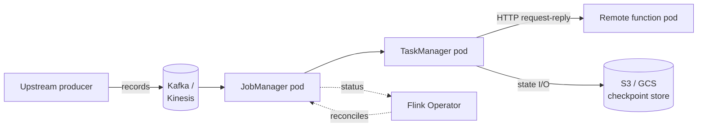

# Kubernetes deployment

> Production deployment uses the [Flink Kubernetes Operator](https://nightlies.apache.org/flink/flink-kubernetes-operator-docs-stable/) to manage StateFun as a `FlinkDeployment` custom resource. Same shape as the Kzmlabs E2E gate, real cloud.

## Topology



## Prerequisites

- **Kubernetes 1.27+**
- **Cert-manager** (Operator dependency)
- **Flink Kubernetes Operator 1.15+** (adds Flink 2.2 support)
- An **S3-compatible bucket** for checkpoints (S3, GCS via interop, MinIO, Ceph)
- IAM Roles for Service Accounts (IRSA) on EKS for credential-free S3 / Kinesis access (recommended)

## Minimal `FlinkDeployment`

```yaml
apiVersion: flink.apache.org/v1beta1
kind: FlinkDeployment
metadata:
  name: my-statefun
  namespace: my-app
spec:
  image: ghcr.io/kzmlabs/flink-statefun:3.4.0-KZM-3.4
  flinkVersion: v2_2
  flinkConfiguration:
    state.backend.type: rocksdb
    state.checkpoints.dir: s3://my-bucket/checkpoints
    high-availability.type: kubernetes
    high-availability.storageDir: s3://my-bucket/ha
    execution.checkpointing.interval: "10000"
  jobManager:
    resource: { memory: 1024m, cpu: 0.5 }
  taskManager:
    resource: { memory: 2048m, cpu: 1 }
  podTemplate:
    spec:
      containers:
        - name: flink-main-container
          env:
            - name: STATEFUN_MODULE_PATH
              value: /opt/flink/conf/module.yaml
          volumeMounts:
            - { name: module, mountPath: /opt/flink/conf }
      volumes:
        - name: module
          configMap: { name: my-module-yaml }
  job:
    jarURI: local:///opt/flink/usrlib/statefun-flink-runner.jar
    state: running
    upgradeMode: stateless
```

## `module.yaml` ConfigMap

Mount the StateFun module specification (ingresses, egresses, function endpoints) as a ConfigMap referenced via `STATEFUN_MODULE_PATH`:

```yaml
apiVersion: v1
kind: ConfigMap
metadata:
  name: my-module-yaml
data:
  module.yaml: |
    kind: io.statefun.endpoints.v2/http
    spec:
      functions: example/*
      urlPathTemplate: http://my-remote-function.my-app.svc:8080/statefun

    ---
    kind: io.statefun.kafka.v1/ingress
    spec:
      id: example/orders
      address: kafka.my-app.svc:9092
      consumerGroupId: example-statefun
      topics:
        - topic: example.orders
          valueType: example/Order
          targets: [example/order-handler]
```

## Configuration changes (Flink 2.x)

Flink 2.x renamed several configuration keys. The differences most likely to bite when migrating from a Flink 1.16 setup:

| Old (Flink 1.x) | New (Flink 2.x) |
|---|---|
| `state.backend` | `state.backend.type` |
| `high-availability` | `high-availability.type` |
| `restart-strategy` | `restart-strategy.type` |

!!! warning "Use the fully-qualified keys"

    The short forms are no longer recognized in Flink 2.x. The Operator will silently use defaults if you keep the old keys.

## Logging

JobManager and TaskManager emit **JSON logs** out of the box — the runtime image bundles the Logback JSON encoder, driven by the `spec.logConfiguration` (`logback-console.xml`) on the `FlinkDeployment`. No image changes needed.

!!! note "Operator pod logs"

    The **Operator pod** itself logs plain text via Log4j2 (its default). Operator 1.15 can run on Logback, but its base image bundles Logback 1.2.x with no JSON encoder, so JSON Operator logs would require a custom Operator image bundling `logstash-logback-encoder`. The Operator is infra, not application output, so this is rarely worth the maintenance — leave it on the Log4j2 default unless your log pipeline requires JSON from every pod.

## Tuning

### JobManager startup time

A typical kzmlabs StateFun JM startup breakdown on EKS:

| Phase | Time |
|---|---|
| JVM classloading | ~22 s |
| Leader election (default 160 s lease) | ~2 s after tuning |
| HA recovery | ~6 s |
| TaskManager pod startup | ~26 s |

For faster failover, override the leader-election timing:

```yaml
flinkConfiguration:
  high-availability.kubernetes.leader-election.lease-duration: "15s"
  high-availability.kubernetes.leader-election.renew-deadline: "10s"
  high-availability.kubernetes.leader-election.retry-period: "2s"
```

### Remote function scaling

The remote function pod is independent of the StateFun TaskManager. Scale it with a Deployment + HPA:

```yaml
apiVersion: apps/v1
kind: Deployment
metadata: { name: my-remote-function }
spec:
  replicas: 3
  template:
    spec:
      containers:
        - name: rf
          image: my-org/my-remote-function:1.0.0
          ports: [{ containerPort: 8080 }]
          readinessProbe:
            httpGet: { path: /health, port: 8080 }
---
apiVersion: autoscaling/v2
kind: HorizontalPodAutoscaler
metadata: { name: my-remote-function }
spec:
  scaleTargetRef: { apiVersion: apps/v1, kind: Deployment, name: my-remote-function }
  minReplicas: 3
  maxReplicas: 30
  metrics:
    - type: Resource
      resource: { name: cpu, target: { type: Utilization, averageUtilization: 70 } }
```

The TaskManager opens HTTP connections to the function service and fans out concurrent requests; HPA scales horizontally on CPU.

### Checkpoint storage on EKS via IRSA

```yaml
podTemplate:
  spec:
    serviceAccountName: my-statefun-sa     # bound to IAM role with s3:* on the bucket
    containers:
      - name: flink-main-container
        env:
          - name: AWS_REGION
            value: us-east-1
```

No static AWS keys, no `awsCredentials` block needed for the S3 plugin filesystem.

## Restricted-network mirrors

Set `IMAGE_REGISTRY_PREFIX` at build time to pull all base images through your internal mirror — full details in the [build guide](../build.md).

## Next steps

<div class="grid cards" markdown>

- :material-test-tube:{ .lg .middle } &nbsp; **[E2E test architecture](../architecture/e2e-tests.md)** — same Operator + manifests, exercised by CI.
- :material-server-network:{ .lg .middle } &nbsp; **[Kafka I/O](kafka-io.md)** — production ingress/egress configuration patterns.
- :material-aws:{ .lg .middle } &nbsp; **[Kinesis I/O](kinesis-io.md)** — IRSA-based AWS credential setup.
- :material-source-branch-sync:{ .lg .middle } &nbsp; **[Migrate from Apache StateFun](../upstream-vs-kzm.md)** — what changes when moving to StateFun Actors on Flink 2.x.

</div>
