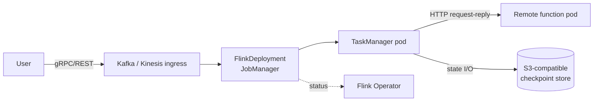

# Kubernetes deployment

Production deployment uses the [Flink Kubernetes Operator](https://nightlies.apache.org/flink/flink-kubernetes-operator-docs-stable/) to manage StateFun as a `FlinkDeployment` custom resource.

## Topology



## Prerequisites

- Kubernetes 1.27+
- Cert-manager (Operator dependency)
- Flink Kubernetes Operator 1.11+
- An S3-compatible bucket for checkpoints

## Minimal `FlinkDeployment` CR

```yaml
apiVersion: flink.apache.org/v1beta1
kind: FlinkDeployment
metadata:
  name: my-statefun
  namespace: my-app
spec:
  image: ghcr.io/kzmlabs/flink-statefun:3.4.0-KZM-3.1
  flinkVersion: v2_0
  flinkConfiguration:
    state.backend.type: rocksdb
    state.checkpoints.dir: s3://my-bucket/checkpoints
    high-availability.type: kubernetes
    high-availability.storageDir: s3://my-bucket/ha
    execution.checkpointing.interval: "10000"
  jobManager:
    resource:
      memory: 1024m
      cpu: 0.5
  taskManager:
    resource:
      memory: 2048m
      cpu: 1
  podTemplate:
    spec:
      containers:
        - name: flink-main-container
          env:
            - name: STATEFUN_MODULE_PATH
              value: /opt/flink/conf/module.yaml
          volumeMounts:
            - name: module
              mountPath: /opt/flink/conf
      volumes:
        - name: module
          configMap:
            name: my-module-yaml
  job:
    jarURI: local:///opt/flink/usrlib/statefun-flink-runner.jar
    state: running
    upgradeMode: stateless
```

## `module.yaml` ConfigMap

The StateFun module specification (ingresses, egresses, function endpoints) is mounted as a ConfigMap and referenced via `STATEFUN_MODULE_PATH`.

```yaml
apiVersion: v1
kind: ConfigMap
metadata:
  name: my-module-yaml
data:
  module.yaml: |
    kind: io.statefun.endpoints.v2/http
    spec:
      functions: example/*
      urlPathTemplate: http://my-remote-function.my-app.svc:8080/statefun

    kind: io.statefun.kafka.v1/ingress
    spec:
      ...
```

## Configuration notes (Flink 2.x)

Flink 2.x renamed several configuration keys vs Flink 1.x. The differences most likely to bite:

| Old (Flink 1.x) | New (Flink 2.x) |
|---|---|
| `state.backend` | `state.backend.type` |
| `high-availability` | `high-availability.type` |
| `restart-strategy` | `execution.restart-strategy.type` |

Use the **fully-qualified** keys; the short forms are no longer recognized.

## Tuning

### JobManager startup

A typical kzmlabs StateFun JM startup breakdown:

| Phase | Time |
|---|---|
| JVM classloading | ~22 s |
| Leader election (with default 160s lease) | ~2 s after tuning |
| HA recovery | ~6 s |
| TaskManager pod startup | ~26 s |

For faster failover, override the leader-election timing:

```yaml
flinkConfiguration:
  high-availability.kubernetes.leader-election.lease-duration: 15s
  high-availability.kubernetes.leader-election.renew-deadline: 10s
  high-availability.kubernetes.leader-election.retry-period: 2s
```

## See also

- [Architecture / E2E tests](../architecture/e2e-tests.md) — the kzmlabs E2E suite is a good reference deployment
- [Kafka I/O](kafka-io.md) and [Kinesis I/O](kinesis-io.md) — ingress/egress configuration
