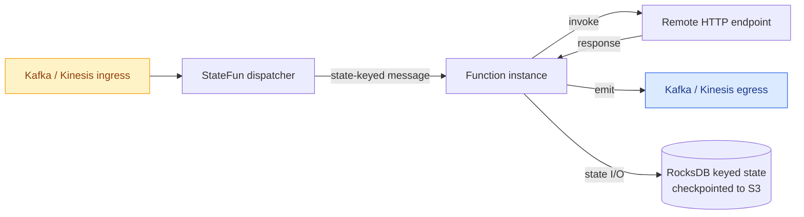

## What is StateFun Actors?

You write a function keyed by a logical id. The runtime gives it per-key durable state, routes messages to it, replays on failure, and connects it to Kafka and Kinesis. **Actor programming on top of Apache Flink - without writing a Flink job by hand.**

This is the actively maintained continuation of [Apache Stateful Functions](https://github.com/apache/flink-statefun): same programming model, current Flink, current Java, restored Kinesis I/O, and a real Kubernetes end-to-end gate before every release.

## Focus on logic, not on Flink plumbing

<div class="kzm-compare" markdown>
<div class="kzm-compare__bad" markdown>

#### Without StateFun

```java
public class CounterFunction
    extends KeyedProcessFunction<String, Event, Result> {

  private ValueState<Long> count;

  @Override
  public void open(Configuration cfg) {
    count = getRuntimeContext().getState(
      new ValueStateDescriptor<>("count", Long.class));
  }

  @Override
  public void processElement(Event e, Context ctx, Collector<Result> out) {
    Long c = count.value();
    if (c == null) c = 0L;
    count.update(c + 1);
    out.collect(new Result(e.id(), c + 1));
  }
}
// + Kafka source, sink, watermarks,
//   keyBy, checkpoint config, etc.
```

</div>
<div class="kzm-compare__good" markdown>

#### With StateFun Actors

```java
public class Counter implements StatefulFunction {

  @Persisted
  PersistedValue<Long> count =
      PersistedValue.of("count", Long.class);

  @Override
  public void invoke(Context ctx, Object input) {
    long c = Optional.ofNullable(count.get()).orElse(0L) + 1;
    count.set(c);
    ctx.send(EgressIdentifier.of("results"),
             new Result(ctx.self().id(), c));
  }
}
// Routing, ingress, egress, checkpoints
// declared in module.yaml.
```

</div>
</div>

## Built for

<div class="grid cards" markdown>

-   :material-shield-alert:{ .lg .middle } &nbsp; **Real-time fraud detection**

    ---

    Per-account state, sub-second decisions on Kafka transaction streams.

    [:octicons-arrow-right-24: Walkthrough](examples/fraud-detection.md)

-   :material-router-network:{ .lg .middle } &nbsp; **IoT digital twins**

    ---

    Per-device state, command/control, telemetry rollups at fleet scale.

    [:octicons-arrow-right-24: Walkthrough](examples/iot-fleet.md)

</div>

More patterns work the same way - order workflows, payment sagas, polyglot microservices, real-time scoring. The model in [Architecture overview](architecture/index.md) is the same in every case: durable per-key state plus exactly-once messaging.

## Polyglot SDKs and pluggable I/O

Write functions in whichever language fits the team. Plug into the streaming and storage substrate you already run.

<div class="kzm-logo-grid" markdown>
<div markdown="span">:fontawesome-brands-java:{ .twemoji } &nbsp; Java SDK</div>
<div markdown="span">:fontawesome-brands-python:{ .twemoji } &nbsp; Python SDK</div>
<div markdown="span">:fontawesome-brands-golang:{ .twemoji } &nbsp; Go SDK</div>
<div markdown="span">:fontawesome-brands-js:{ .twemoji } &nbsp; JavaScript SDK</div>
</div>

<div class="kzm-logo-grid" markdown>
<div markdown="span">:simple-apachekafka:{ .twemoji } &nbsp; Apache Kafka</div>
<div markdown="span">:simple-amazonaws:{ .twemoji } &nbsp; AWS Kinesis</div>
<div markdown="span">:simple-kubernetes:{ .twemoji } &nbsp; Kubernetes</div>
<div markdown="span">:material-database:{ .twemoji } &nbsp; S3 checkpoints</div>
</div>

## Why this continuation exists

Apache Stateful Functions stopped releasing in **October 2024** at version 3.4.0, locked to **Flink 1.16** and **Java 11**. Anyone wanting to run it against modern Flink either pinned old dependencies or vendored their own patches. StateFun Actors is the public, actively maintained continuation - same code, modern stack, no vendor lock-in.

| | Apache StateFun 3.4.0 | StateFun Actors KZM-3.4 |
|---|---|---|
| **Flink runtime** | 1.16.2 | **2.2.1** |
| **Java baseline** | 11 | **21** |
| **Maven group** | `org.apache.flink` | `io.github.kzmlabs.flinkstatefun` |
| **Kinesis I/O** | Flink 1.x consumer | **Restored** on Flink 2.x source/sink |
| **K8s release gate** | None | **Mandatory** kind + Flink Operator + LocalStack |
| **Active CI** | Inactive after 3.4.0 | Dependabot, CodeQL, Scorecard, Trivy |
| **Release cadence** | Dormant | Active (Maven Central + GHCR) |

[Full migration notes →](upstream-vs-kzm.md)

## What you get

-   **Per-key durable state** - read and write your function's own state without manually wiring Flink keyed-state primitives.
-   **Exactly-once messaging** between functions and to/from external systems, riding Flink's checkpointing.
-   **Polyglot remote functions** - write functions as HTTP endpoints in any language; the runtime owns state and routing.
-   **Kafka record headers, end-to-end** *(new in KZM-3.4)* - functions read the headers of the record that triggered them and set headers on egress records, with Kafka-exact null semantics and per-topic opt-in. [Guide →](guides/kafka-headers.md)
-   **Deployment flexibility** - embedded in Flink, co-located with the JobManager, or remote HTTP services scaled independently.
-   **Production-grade releases** - every version is gated on a real K8s end-to-end run with the Flink Operator, Kafka, S3 checkpoints, and the actual remote-function pod.

## At a glance



[Read the architecture overview →](architecture/index.md)

!!! tip "Already running Apache StateFun?"

    Most user code keeps working unchanged. The only required change is the Maven coordinate: `org.apache.flink:statefun-*` → `io.github.kzmlabs.flinkstatefun:statefun-*`. Full migration notes in the [upstream comparison](upstream-vs-kzm.md).

## Project status and security

Releases are signed via Sigstore keyless attestation, scanned with Trivy, and tracked by [OpenSSF Scorecard](https://scorecard.dev/viewer/?uri=github.com/kzmlabs/flink-statefun). Container images carry SLSA build provenance.

Verify a release artifact with the GitHub CLI:

```bash
gh attestation verify oci://ghcr.io/kzmlabs/flink-statefun:3.4.0-KZM-3.5 --owner kzmlabs
```

## Where next

| If you want to… | Go to |
|---|---|
| Run StateFun locally and send a test message | [Quickstart](quickstart.md) |
| Add the dependency to your project | [Install](install.md) |
| Build the project from source | [Building from source](build.md) |
| **See real-time fraud detection end-to-end** | [Fraud detection example](examples/fraud-detection.md) |
| **See an IoT digital-twin system end-to-end** | [IoT fleet example](examples/iot-fleet.md) |
| Wire up Kafka ingress and egress | [Kafka I/O guide](guides/kafka-io.md) |
| Wire up Kinesis ingress and egress | [Kinesis I/O guide](guides/kinesis-io.md) |
| Deploy on a real Kubernetes cluster | [K8s deployment guide](guides/k8s-deployment.md) |
| Understand how Protobuf shading works | [Architecture / shading](architecture/shading.md) |
| Migrate from Apache Stateful Functions | [Differences from upstream](upstream-vs-kzm.md) |
| Cut a new release | [Release process](release-process.md) |
