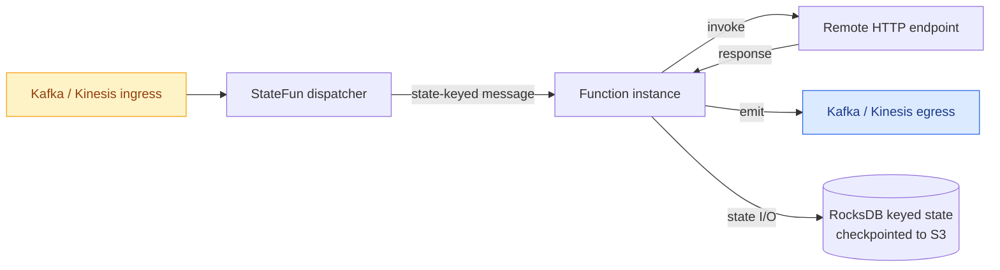

# Kzmlabs StateFun

> Stateful actors on Apache Flink — durable per-key state, exactly-once messaging, Kafka and Kinesis I/O, Kubernetes-native deployment.

[](https://central.sonatype.com/artifact/io.github.kzmlabs.flinkstatefun/statefun-bom){ .md-button-link }
[](https://github.com/kzmlabs/flink-statefun/blob/release/LICENSE)
[](https://github.com/kzmlabs/flink-statefun/actions/workflows/ci.yml?query=branch%3Arelease)
[](https://github.com/kzmlabs/flink-statefun/actions/workflows/e2e-test.yml?query=branch%3Arelease)
[](https://github.com/kzmlabs/flink-statefun/actions/workflows/codeql.yml?query=branch%3Arelease)
[](https://scorecard.dev/viewer/?uri=github.com/kzmlabs/flink-statefun)

## What is Kzmlabs StateFun?

You write a function keyed by a logical id. The runtime gives it per-key durable state, routes messages to it, replays on failure, and connects it to Kafka and Kinesis. **Actor programming on top of Apache Flink — without writing a Flink job by hand.**

This is the actively maintained continuation of [Apache Stateful Functions](https://github.com/apache/flink-statefun): same programming model, current Flink, current Java, restored Kinesis I/O, and a real Kubernetes end-to-end gate before every release.

**Use cases:** event-driven microservices, real-time fraud detection, IoT digital twins, payment orchestration, actor-style stateful compute, distributed sagas, serverless stream processing.

## Start here

<div class="grid cards" markdown>

-   :material-rocket-launch:{ .lg .middle } &nbsp; **Quickstart**

    ---

    Run a StateFun job locally in five minutes — Docker, Kafka, a remote function.

    [:octicons-arrow-right-24: Quickstart](quickstart.md)

-   :material-package-variant:{ .lg .middle } &nbsp; **Install**

    ---

    Maven coordinates, BOM import, Docker image, version matrix.

    [:octicons-arrow-right-24: Install](install.md)

-   :material-kubernetes:{ .lg .middle } &nbsp; **Deploy on Kubernetes**

    ---

    Production layout via the Flink Kubernetes Operator + RocksDB checkpoints to S3.

    [:octicons-arrow-right-24: K8s deployment](guides/k8s-deployment.md)

-   :material-source-branch:{ .lg .middle } &nbsp; **Migrate from Apache StateFun**

    ---

    What's different, and what changes you need to make in your code.

    [:octicons-arrow-right-24: Differences from upstream](upstream-vs-kzm.md)

</div>

## Why this fork exists

Apache Stateful Functions stopped releasing in **October 2024** at version 3.4.0, locked to **Flink 1.16** and **Java 11**. Anyone wanting to run it against modern Flink either pinned old dependencies or vendored their own patches. Kzmlabs StateFun is the public, actively maintained branch — same code, modern stack, no vendor lock-in.

| | Apache StateFun 3.4.0 | Kzmlabs StateFun KZM-3.1 |
|---|---|---|
| **Flink runtime** | 1.16.2 | **2.2.0** |
| **Java baseline** | 11 | **21** |
| **Maven group** | `org.apache.flink` | `io.github.kzmlabs.flinkstatefun` |
| **Kinesis I/O** | Flink 1.x consumer | **Restored** on Flink 2.x source/sink |
| **K8s release gate** | None | **Mandatory** kind + Flink Operator + LocalStack |
| **Active CI** | Inactive after 3.4.0 | Dependabot, CodeQL, Scorecard, Trivy |
| **Release cadence** | Dormant | Active (Maven Central + GHCR) |

Full migration notes → [Differences from Apache StateFun](upstream-vs-kzm.md).

## What you get

-   **Per-key durable state** — read and write your function's own state without manually wiring Flink keyed-state primitives.
-   **Exactly-once messaging** between functions and to/from external systems, riding Flink's checkpointing.
-   **Polyglot remote functions** — write functions as HTTP endpoints in any language; the runtime owns state and routing.
-   **Deployment flexibility** — embedded in Flink, co-located with the JobManager, or remote HTTP services scaled independently.
-   **Production-grade releases** — every version is gated on a real K8s end-to-end run with the Flink Operator, Kafka, S3 checkpoints, and the actual remote-function pod.

## At a glance



[Read the architecture overview →](architecture/index.md)

!!! tip "Already running Apache StateFun?"

    Most user code keeps working unchanged. The only required change is the Maven coordinate: `org.apache.flink:statefun-*` → `io.github.kzmlabs.flinkstatefun:statefun-*`. Full migration notes in the [upstream comparison](upstream-vs-kzm.md).

## Project status and security

Releases are signed via Sigstore keyless attestation, scanned with Trivy, and tracked by [OpenSSF Scorecard](https://scorecard.dev/viewer/?uri=github.com/kzmlabs/flink-statefun). Container images carry SLSA build provenance.

Verify a release artifact with the GitHub CLI:

```bash
gh attestation verify oci://ghcr.io/kzmlabs/flink-statefun:3.4.0-KZM-3.1 --owner kzmlabs
```

## Where next

| If you want to… | Go to |
|---|---|
| Run StateFun locally and send a test message | [Quickstart](quickstart.md) |
| Add the dependency to your project | [Install](install.md) |
| Build the project from source | [Building from source](build.md) |
| **See real-time fraud detection end-to-end** | [Fraud detection example](examples/fraud-detection.md) |
| **See an IoT digital-twin system end-to-end** | [IoT fleet example](examples/iot-fleet.md) |
| Wire up Kafka ingress and egress | [Kafka I/O guide](guides/kafka-io.md) |
| Wire up Kinesis ingress and egress | [Kinesis I/O guide](guides/kinesis-io.md) |
| Deploy on a real Kubernetes cluster | [K8s deployment guide](guides/k8s-deployment.md) |
| Understand how Protobuf shading works | [Architecture / shading](architecture/shading.md) |
| Migrate from Apache Stateful Functions | [Differences from upstream](upstream-vs-kzm.md) |
| Cut a new release | [Release process](release-process.md) |
