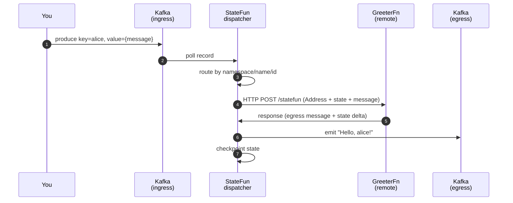

# Quickstart

> Five minutes from `git clone` to a verified round-trip message. Copy-pasteable, idempotent, no AWS credentials required.

## Before you start

You'll need:

- **Docker** (`docker compose` v2)
- **`curl`** (any modern version)
- ~3 GB free disk space and ~2 GB RAM available to Docker

That's it. No JDK, no Maven, no Kubernetes.

## 1. Pull the repository

```bash
git clone https://github.com/kzmlabs/flink-statefun.git
cd flink-statefun
```

## 2. Start the local stack

```bash
cd dev
docker compose up -d
```

This brings up four containers:

| Container | Role |
|---|---|
| `statefun-jobmanager` | Flink 2.2 JobManager running the StateFun runtime |
| `statefun-taskmanager` | Flink 2.2 TaskManager (workers) |
| `statefun-kafka` | Kafka KRaft mode, single broker |
| `statefun-remote-function` | HTTP endpoint exposing a sample `GreeterFn` |

Wait ~30 s for the cluster to settle, then verify:

```bash
docker compose ps
```

Every container should be `Up (healthy)`.

## 3. Create the ingress topic

```bash
docker exec statefun-kafka kafka-topics --bootstrap-server localhost:9092 \
  --create --topic dev.events.test-ingress \
  --partitions 1 --replication-factor 1
```

## 4. Send a message

```bash
echo 'alice:{"message": "Hello!"}' | docker exec -i statefun-kafka \
  kafka-console-producer --broker-list localhost:9092 \
  --topic dev.events.test-ingress \
  --property "parse.key=true" --property "key.separator=:"
```

Format: `<key>:<JSON value>`. The key (`alice`) is the function instance id; the value is the message payload.

## 5. Watch the function react

=== "Tail the function logs"

    ```bash
    docker logs -f statefun-remote-function
    ```

    You should see a line like:

    ```
    [GreeterFn] alice → "Hello, alice!"
    ```

=== "Read from the egress topic"

    ```bash
    docker exec statefun-kafka kafka-console-consumer \
      --bootstrap-server localhost:9092 \
      --topic dev.events.test-egress \
      --from-beginning --max-messages 1
    ```

## 6. Tear down

```bash
docker compose down -v
```

Removes containers + volumes. Re-running `docker compose up -d` starts a clean cluster.

## What just happened



The runtime owns state, routing, exactly-once delivery, and checkpointing. Your function is just `Context + Message → response`.

## Next steps

<div class="grid cards" markdown>

- :material-package-variant:{ .lg .middle } &nbsp; **[Install in your project](install.md)** — Maven coordinates, BOM import, version matrix.
- :material-source-branch:{ .lg .middle } &nbsp; **[Build from source](build.md)** — full reactor build with the K8s E2E gate.
- :material-server-network:{ .lg .middle } &nbsp; **[Kafka I/O guide](guides/kafka-io.md)** — `module.yaml` configuration patterns.
- :material-kubernetes:{ .lg .middle } &nbsp; **[Deploy on Kubernetes](guides/k8s-deployment.md)** — production layout via the Flink Operator.

</div>
