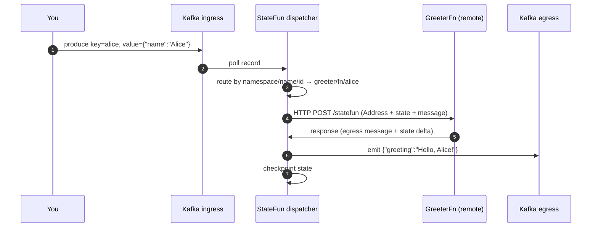

# Quickstart

> Five minutes from `git clone` to a verified round-trip message. Copy-pasteable, all containers pulled from public registries plus one tiny local build.

## Before you start

You'll need:

- **Docker** (`docker compose` v2)
- ~3 GB free disk space and ~4 GB RAM available to Docker

That's it. No JDK, no Maven, no Kubernetes.

## 1. Pull the repository

```bash
git clone https://github.com/kzmlabs/flink-statefun.git
cd flink-statefun
```

## 2. Start the local stack

```bash
cd examples/quickstart
docker compose up -d --wait --build
```

`--wait` blocks until every healthcheck passes; `--build` builds the local greeter image on first run (~1–2 min cold, cached afterwards). This brings up six containers:

| Container | Role |
|---|---|
| `quickstart-kafka` | Kafka 3.9 in KRaft mode, single broker (no ZooKeeper) |
| `quickstart-kafka-init` | One-shot: creates the `greeter.commands` and `greeter.results` topics, then exits |
| `quickstart-greeter` | Sample StateFun remote function over HTTP (`/statefun`) |
| `quickstart-jobmanager` | Flink 2.2 JobManager + StateFun runtime, exposes the Web UI on `localhost:8081` |
| `quickstart-taskmanager` | Flink 2.2 TaskManager (one slot, parallelism 1) |
| `quickstart-job-submit` | One-shot: submits the StateFun job to the JobManager, then exits |

Verify everything is up:

```bash
docker compose ps
```

`kafka`, `greeter`, `jobmanager`, and `taskmanager` should be `Up (healthy)`. `kafka-init` and `job-submit` are one-shots — they appear as `Exited (0)`.

## 3. Send a message

```bash
echo 'alice:{"name":"Alice"}' | docker exec -i quickstart-kafka \
  /opt/kafka/bin/kafka-console-producer.sh \
  --bootstrap-server kafka:9092 \
  --topic greeter.commands \
  --property "parse.key=true" --property "key.separator=:"
```

Format: `<key>:<JSON value>`. The key (`alice`) becomes the function instance id; the value is parsed by the function.

## 4. Read the response

```bash
docker exec quickstart-kafka \
  /opt/kafka/bin/kafka-console-consumer.sh \
  --bootstrap-server kafka:9092 \
  --topic greeter.results \
  --from-beginning --max-messages 1
```

Expected output:

```json
{"greeting":"Hello, Alice!"}
```

The Flink Web UI on [http://localhost:8081](http://localhost:8081) shows the running `statefun-quickstart` job — checkpoint counters tick up every 10 seconds.

## 5. Tear down

```bash
docker compose down -v
```

Removes containers + volumes. Re-running `docker compose up -d --wait` starts a clean cluster.

## What just happened



The runtime owns state, routing, exactly-once delivery, and checkpointing. Your function is just `Context + Message → response`.

## Troubleshooting

??? failure "`docker compose up` hangs on `--wait`"

    Check which container is unhealthy:

    ```bash
    docker compose ps
    docker compose logs jobmanager
    docker compose logs taskmanager
    docker compose logs greeter
    ```

    Most common causes: Docker has less than 4 GB RAM available, or host ports `8081` / `9094` are already in use.

??? failure "`pull access denied` on the GHCR image"

    The image is public. If you see this, your local Docker is logged into a different GHCR account that lacks access. Run `docker logout ghcr.io` and try again, or pin to a different tag with `docker pull ghcr.io/kzmlabs/flink-statefun:3.4.0-KZM-3.1` to verify connectivity.

??? failure "Step 4 returns no output / consumer hangs"

    Either the job hasn't submitted yet (check `docker compose logs job-submit` for the submission line), the greeter container isn't healthy (check `docker compose logs greeter`), or the producer failed silently (re-run step 3 and watch for errors). The Flink Web UI on `localhost:8081` will show whether the job is `RUNNING`.

## Next steps

<div class="grid cards" markdown>

- :material-package-variant:{ .lg .middle } &nbsp; **[Install in your project](install.md)** — Maven coordinates, BOM import, version matrix.
- :material-source-branch:{ .lg .middle } &nbsp; **[Build from source](build.md)** — full reactor build with the K8s E2E gate.
- :material-server-network:{ .lg .middle } &nbsp; **[Kafka I/O guide](guides/kafka-io.md)** — `module.yaml` configuration patterns.
- :material-kubernetes:{ .lg .middle } &nbsp; **[Deploy on Kubernetes](guides/k8s-deployment.md)** — production layout via the Flink Operator.

</div>
