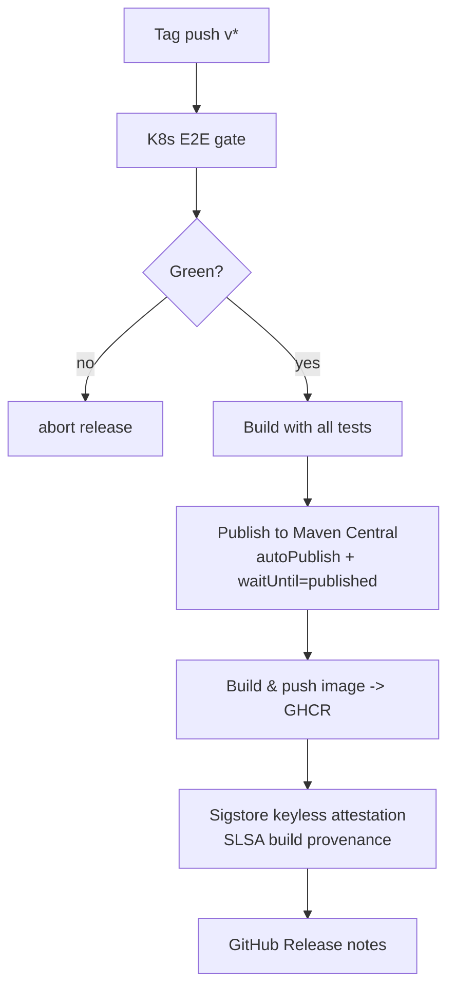

# Release process

> Tag-driven CI. Push a `v*` tag, the pipeline runs the K8s E2E gate, then publishes to Maven Central and GHCR with Sigstore attestation. Total time: ~25–30 minutes.

## Triggering a release

```bash
# 1. Bump the version
./bump-version.sh 3.4.0-KZM-3.2

# 2. Push the version-bump commit to a release branch
git checkout -b release-3.4.0-KZM-3.2
git push -u origin release-3.4.0-KZM-3.2

# 3. Open and merge a PR targeting `release` (CI green required)

# 4. After merge, tag and push
git checkout release && git pull
git tag v3.4.0-KZM-3.2
git push origin v3.4.0-KZM-3.2
```

The tag push triggers `release.yml`.

## Pipeline



| Phase | Time |
|---|---|
| K8s E2E gate | ~6 min |
| Build + tests | ~5 min |
| Maven Central publish (Sonatype `waitUntil=published`) | up to 20 min on slow days |
| GHCR push + attestation | ~2 min |
| GitHub Release | seconds |

The Sonatype Central wait dominates total time and is outside our control.

## Docker-only releases

For runtime image fixes that don't change the SDK:

```bash
git tag docker-3.4.0-KZM-3.2
git push origin docker-3.4.0-KZM-3.2
```

Triggers `docker-release.yml`, which skips Maven Central and only refreshes the GHCR image. ~10 minutes.

## Stability conventions

| Tag pattern | What it means |
|---|---|
| `vX.Y.Z-KZM-N.M` | **Stable release**. Pushes the Docker `latest` tag. |
| `vX.Y.Z-KZM-N.M-RCk` | **Release candidate**. Same artifacts; `latest` tag is **not** updated. |
| `docker-X.Y.Z-KZM-N.M` | **Docker-only refresh** of an existing release. |

## Branch model

| Branch | Role |
|---|---|
| **`release`** | Active development. All PRs target this branch. Branch protection: merge queue, code-owner review, K8s E2E required. |
| `master` | Vestigial Apache upstream pointer. Not used for development. |

## Verification

After a release lands, verify each artifact:

```bash
# Maven Central artifact resolution
./mvnw dependency:get \
  -Dartifact=io.github.kzmlabs.flinkstatefun:statefun-bom:3.4.0-KZM-3.2:pom

# Docker image
docker pull ghcr.io/kzmlabs/flink-statefun:3.4.0-KZM-3.2

# Sigstore attestation
gh attestation verify \
  oci://ghcr.io/kzmlabs/flink-statefun:3.4.0-KZM-3.2 \
  --owner kzmlabs
```

The attestation verification proves the image was built by GitHub Actions in this repo from the tag's commit — supply-chain provenance with no manual signing key to manage.

## Hotfix flow

For a critical fix on a released line without bumping major/minor:

1. Branch from the release tag: `git checkout -b hotfix/3.4.0-KZM-3.1.1 v3.4.0-KZM-3.1`
2. Apply the fix; bump version to `3.4.0-KZM-3.1.1` via `./bump-version.sh`
3. Open a PR targeting `release`. CI runs full K8s E2E.
4. After merge, tag and push: `git tag v3.4.0-KZM-3.1.1 && git push origin v3.4.0-KZM-3.1.1`

## Next steps

<div class="grid cards" markdown>

- :material-source-branch:{ .lg .middle } &nbsp; **[Build from source](build.md)** — toolchain and contribution workflow.
- :material-test-tube:{ .lg .middle } &nbsp; **[E2E test architecture](architecture/e2e-tests.md)** — what the release gate validates.
- :material-package-variant:{ .lg .middle } &nbsp; **[Install](install.md)** — version matrix.

</div>
