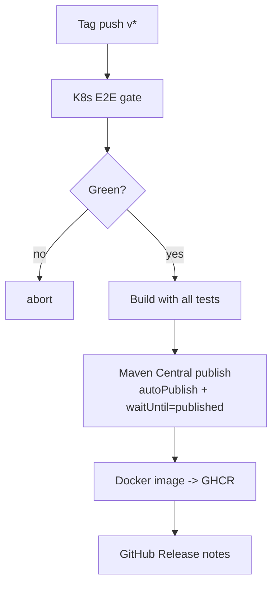

# Release process

Kzmlabs StateFun releases follow a tag-driven CI pipeline.

## Triggering a release

```bash
# 1. Bump the version
./bump-version.sh 3.4.0-KZM-3.2

# 2. Push the version-bump commit to a release branch
git checkout -b release-3.4.0-KZM-3.2
git push -u origin release-3.4.0-KZM-3.2

# 3. Open and merge a PR targeting `release`

# 4. After merge, tag and push
git checkout release && git pull
git tag v3.4.0-KZM-3.2
git push origin v3.4.0-KZM-3.2
```

The tag push triggers `release.yml`, which runs:



Total time: ~25–30 minutes (Sonatype Central wait dominates).

## Docker-only releases

For runtime image fixes that don't change the SDK:

```bash
git tag docker-3.4.0-KZM-3.2
git push origin docker-3.4.0-KZM-3.2
```

This triggers `docker-release.yml`, which skips Maven Central and only refreshes the GHCR image.

## Stability conventions

- **Stable releases** are tagged `vX.Y.Z-KZM-N.M` without RC suffix and push the Docker `latest` tag.
- **Release candidates** are tagged `vX.Y.Z-KZM-N.M-RCk`. Same artifacts, but the Docker `latest` tag is **not** updated.

## Branch model

| Branch | Role |
|---|---|
| `release` | Active development. All PRs target this branch. Branch protection: merge queue, code-owner review, K8s E2E required. |
| `master` | Vestigial Apache upstream pointer. Not used for development. |

## Verification

After a release, verify:

```bash
# Maven Central artifact resolution
./mvnw dependency:get -Dartifact=io.github.kzmlabs.flinkstatefun:statefun-bom:3.4.0-KZM-3.2:pom

# Docker image
docker pull ghcr.io/kzmlabs/flink-statefun:3.4.0-KZM-3.2

# Sigstore attestation (optional)
gh attestation verify oci://ghcr.io/kzmlabs/flink-statefun:3.4.0-KZM-3.2 --owner kzmlabs
```
