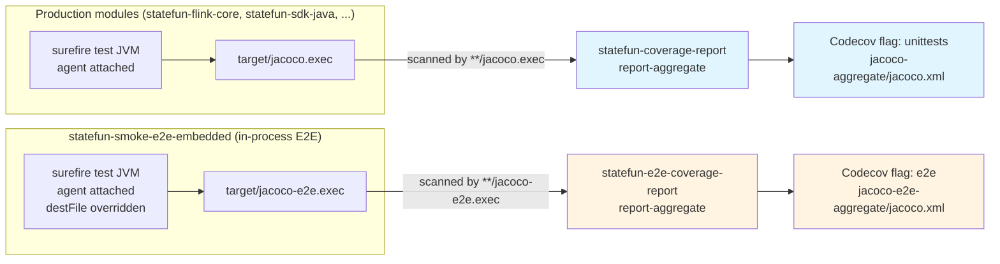
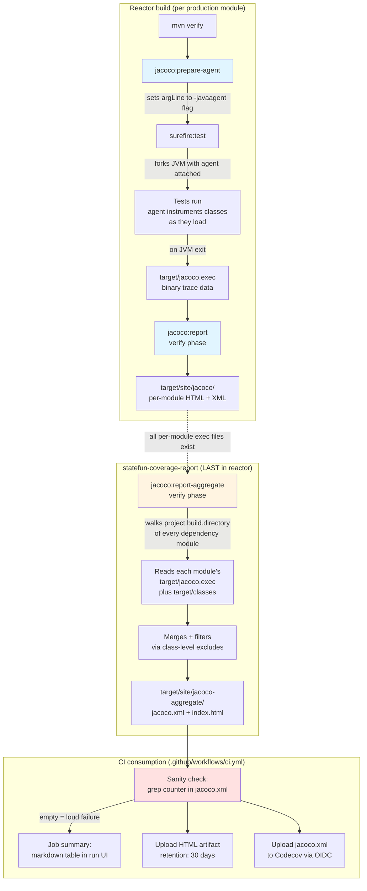
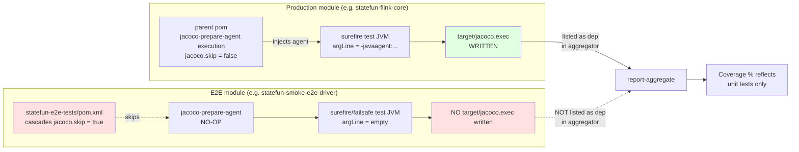
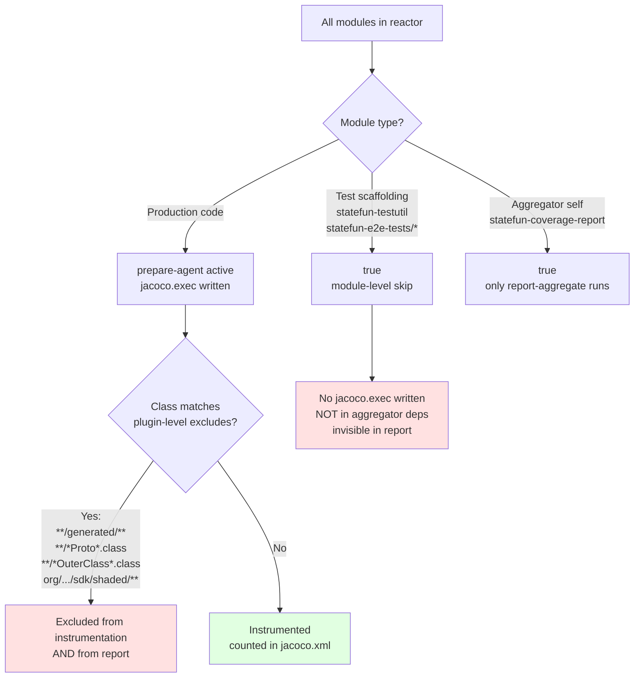
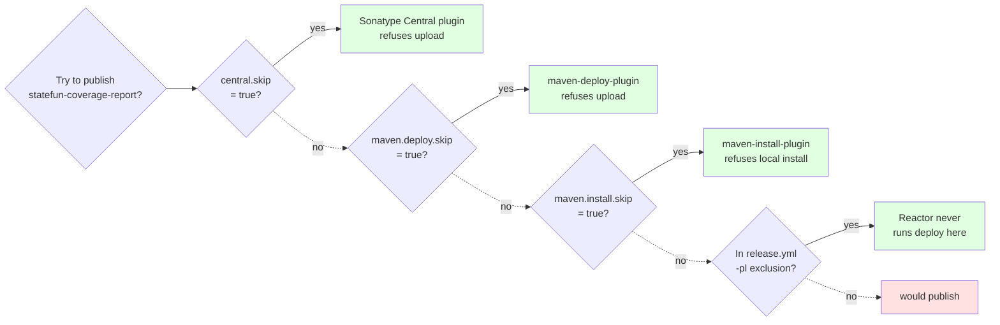

# statefun-coverage-report

Aggregates JaCoCo **unit-test** coverage across every production module in the reactor and produces a single project-wide report. There's a **sibling aggregator**, [`statefun-e2e-coverage-report`](../statefun-e2e-coverage-report/pom.xml), that does the same thing for in-process E2E coverage — see §Two-flag separation below.

This module has **no source code** and produces **no published artifact**. Its only job is to run JaCoCo's `report-aggregate` goal in the `verify` phase, after every other module has written its own `target/jacoco.exec` file.

## Two-flag separation: unit vs E2E

**How separation is enforced (three layers):**

1. **Different output filenames**: production modules write `target/jacoco.exec` (JaCoCo default); `statefun-smoke-e2e-embedded` overrides `<destFile>` in its prepare-agent execution to `target/jacoco-e2e.exec`.
2. **Different `dataFileIncludes` patterns**: this aggregator scans `**/jacoco.exec` (default); the E2E aggregator scans `**/jacoco-e2e.exec` only. Each ignores the other's data files even if they were in the same module.
3. **Different aggregator dependency lists**: this aggregator does NOT list `statefun-smoke-e2e-embedded` as a dep, so `report-aggregate` never even walks its `target/`. The E2E aggregator lists it FIRST.

**What's in each flag:**

| Flag | Source modules | Coverage signal |
|---|---|---|
| `unittests` | All `*Test.java` in production modules + `**/*ITCase.*` integration tests | Per-module unit-test reach against production code |
| `e2e` | `statefun-smoke-e2e-embedded` only — runs StateFun via `statefun-flink-harness` in the surefire JVM | End-to-end scenarios exercising real production paths in-process |

**Container-based E2E (Testcontainers smoke + kind K8s) is intentionally NOT instrumented.** Those tests run production code in separate JVMs (TC containers, K8s pods) where the agent cannot reach without multi-day plumbing (image bake-in, volume mounts, post-run `.exec` extraction). Defer indefinitely per [issue #149 §E2E](https://github.com/kzmlabs/flink-statefun/issues/149) trigger conditions.

---

## End-to-end flow

How a single `mvn install` run turns into a coverage number, from JVM agent injection to GitHub Actions UI:

**Key invariants:**

- The aggregator is the **last module in the reactor** (root `pom.xml` `<modules>`). Maven processes modules in declared order, so `report-aggregate` runs only after every dependency module has written its `jacoco.exec`.
- The agent JVM flag is injected via the parent pom's `surefire` `<argLine>@{argLine} -Xms256m...</argLine>` Maven late-binding. **Without `@{argLine}` the literal value silently swallows the agent**, producing an empty report with no error. The CI sanity check (`grep '<counter '`) turns this silent failure into a loud build failure.

---

## How E2E tests fit in (and why they don't)

E2E tests **do not contribute coverage**, by design. Three independent mechanisms enforce this:

**Three layers preventing E2E from polluting coverage:**

1. **`<jacoco.skip>true</jacoco.skip>`** in `statefun-e2e-tests/pom.xml` cascades to all 10 child modules. The `prepare-agent` execution becomes a no-op, so no `-javaagent` flag is injected into the test JVM.
2. **No `jacoco.exec` is written** for any E2E module. Even if `report-aggregate` tried to scan them (it doesn't), there would be no data.
3. **The aggregator's `<dependencies>` block does not list any `statefun-e2e-tests/*` module**. `report-aggregate` walks declared dependencies only, so E2E modules are never inspected.

**Cross-JVM isolation matters too.** When `statefun-smoke-e2e-driver` boots a Flink job that exercises code in `statefun-flink-core`, the executions happen in **separate JVMs** (Testcontainers spawns containers; kind launches Flink JM/TM pods). Those JVMs don't have the agent attached, so `statefun-flink-core`'s coverage data is unaffected by E2E activity.

**Net effect**: the headline coverage number is **honest unit-test reach** — not "tested by anything". E2E tests still run (validate end-to-end behavior, fail loudly on regressions), they just don't show up as covered lines in the report.

### When E2E coverage WOULD be added

Three trigger conditions, documented in [issue #149 §E2E](https://github.com/kzmlabs/flink-statefun/issues/149):

1. A module's unit-test coverage plateaus low (<40%) and the gap is provably in E2E-only code paths (Kinesis source bootstrap, K8s manifest binder, module-loader classpath scanning).
2. A regression slips through unit tests but is caught by E2E.
3. Apache Flink upstream ships a coverage-friendly E2E harness pattern.

Until then, the multi-day plumbing required to extract `.exec` files from kind-cluster pods is not worth the marginal gain (<5% across the project, mostly already covered by unit tests).

---

## Two-layer exclusion model

**Why two layers (module-level skip + class-level exclude)?**

| Approach | What it does | Used for |
|---|---|---|
| **Module-level `<jacoco.skip>true</jacoco.skip>`** | Disables the agent entirely; module vanishes from per-module view | Test scaffolding only — these modules have no production code worth measuring |
| **Class-level `<excludes>` in plugin config** | Agent ignores matching classes during instrumentation; they show as 0/0 in per-module view, not "vanished" | Generated protobuf code, shaded/relocated bytecode in production modules — the *module* matters (may grow real code later), the *classes* don't |

This matters for `statefun-flink-runner`, `statefun-sdk-protos`, and `statefun-shaded/*`: today they're assembly/generated/shaded with no instrumentable code. **They are still listed in the aggregator's `<dependencies>`** so they appear as N/A in the per-module view rather than vanishing. If a future PR adds real code to one of them, the per-module view immediately shows the new uncovered lines instead of silently bypassing coverage tracking.

`statefun-bom` and `statefun-docker` are NOT in the aggregator dependencies — they have no JAR / no Java code at all, so there's nothing for `report-aggregate` to walk.

---

## Three publication guards

The aggregator must never be published to Maven Central or Docker Hub. Four independent mechanisms enforce this — any one failing still blocks publication:

`<central.skip>` only covers the Sonatype plugin path. `maven-deploy-plugin` and `maven-install-plugin` are independent and would still try to push to whatever `<distributionManagement>` resolves to if the `-pl` exclusion were ever edited. The four-guard design means an aggregator pom edit that accidentally removes one guard still leaves three intact.

---

## Where to view the results

| Location | What you get | Latency from CI run |
|---|---|---|
| **GitHub Actions run summary** | Markdown table with all 6 JaCoCo metric counters (Instruction, Branch, Line, Complexity, Method, Class) | Visible immediately in the run UI |
| **`coverage-report-html` artifact** on the run page | Full drillable JaCoCo HTML site (per-module → package → class → line-level red/green) — download ZIP, open `index.html` | Available as soon as the upload step completes (~10 sec after build) |
| **Codecov dashboard** at `app.codecov.io/gh/kzmlabs/flink-statefun` | Trend graphs, PR coverage delta comments, per-module breakdown, badge URL | ~30 sec after CI uploads (Phase 2 — optional, third-party) |
| **Local `mvn install`** | `statefun-coverage-report/target/site/jacoco-aggregate/index.html` | Immediate — same as the CI artifact, just generated locally |

---

## Skip flag reference

| Module / pattern | `jacoco.skip` | In aggregator deps | Reason |
|---|---|---|---|
| `statefun-flink/*` (rich tests) | false | yes | Production code with unit tests — primary signal |
| `statefun-sdk-java`, `statefun-sdk-embedded` | false | yes | SDK code with unit tests |
| `statefun-kafka-io`, `statefun-kinesis-io` | false | yes | Connector code with unit tests |
| `statefun-sdk-protos` | false | yes | Generated protobuf — class-level excludes drop content; appears as N/A |
| `statefun-flink-runner` | false | yes | Assembly module today; future-proof for code growth |
| `statefun-shaded/*` | false | yes | Relocated bytecode — class-level excludes drop content; appears as N/A |
| `statefun-bom` | n/a | **no** | No JAR, no `.class` files; nothing to walk |
| `statefun-docker` | n/a | **no** | Docker assembly only, no Java |
| `statefun-testutil` | **true** | no | Test scaffolding only |
| `statefun-e2e-tests/*` (10 modules) | **true** | no | E2E in containers; see flow diagram above |
| `statefun-coverage-report` (this module) | **true** | n/a | Aggregator itself; only `report-aggregate` execution runs |
