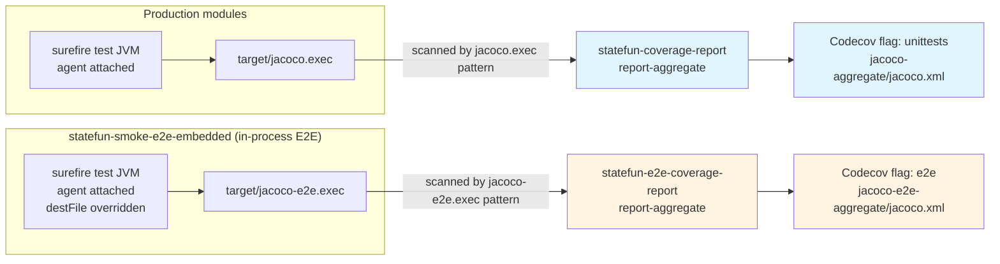
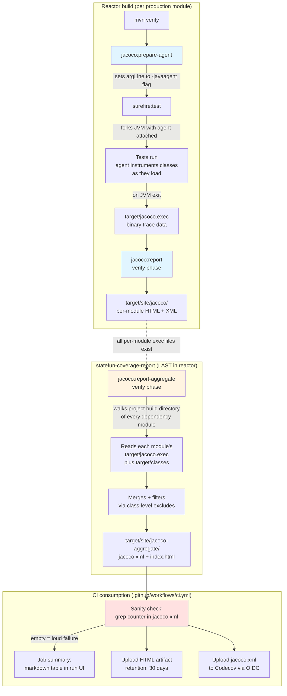
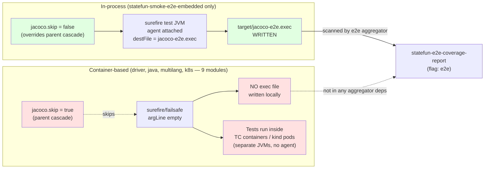
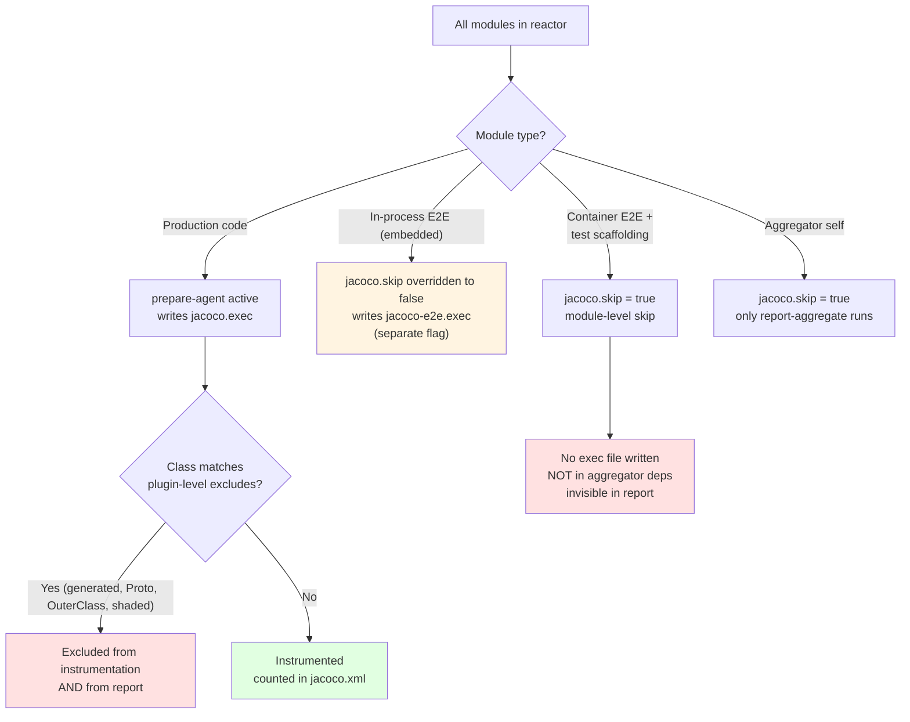
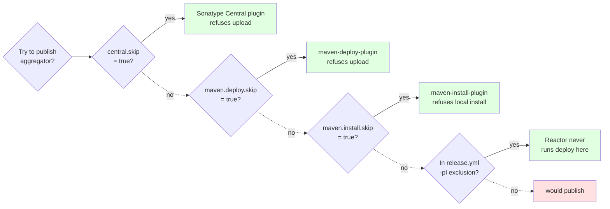

# statefun-coverage-report

Aggregates JaCoCo **unit-test** coverage across every production module in the reactor and produces a single project-wide report. There's a **sibling aggregator**, [`statefun-e2e-coverage-report`](../statefun-e2e-coverage-report/pom.xml), that does the same thing for in-process E2E coverage — see §Two-flag separation below.

This module has **no source code** and produces **no published artifact**. Its only job is to run JaCoCo's `report-aggregate` goal in the `verify` phase, after every other module has written its own `target/jacoco.exec` file.

## Two-flag separation: unit vs E2E

**How separation is enforced (three layers):**

1. **Different output filenames**: production modules write `target/jacoco.exec` (JaCoCo default); `statefun-smoke-e2e-embedded` overrides `<destFile>` in its prepare-agent execution to `target/jacoco-e2e.exec`.
2. **Different `dataFileIncludes` patterns**: this aggregator scans `**/jacoco.exec` (default); the E2E aggregator scans `**/jacoco-e2e.exec` only. Each ignores the other's data files even if they were in the same module.
3. **Different aggregator dependency lists**: this aggregator does NOT list `statefun-smoke-e2e-embedded` as a dep, so `report-aggregate` never even walks its `target/`. The E2E aggregator lists it FIRST.

**What's in each flag:**

| Flag | Source modules | Coverage signal |
|---|---|---|
| `unittests` | All `*Test.java` in production modules + `**/*ITCase.*` integration tests | Per-module unit-test reach against production code |
| `e2e` | `statefun-smoke-e2e-embedded` only — runs StateFun via `statefun-flink-harness` in the surefire JVM | End-to-end scenarios exercising real production paths in-process |

**Container-based E2E (Testcontainers smoke + kind K8s) is intentionally NOT instrumented.** Those tests run production code in separate JVMs (TC containers, K8s pods) where the agent cannot reach without multi-day plumbing (image bake-in, volume mounts, post-run `.exec` extraction). Defer indefinitely per [issue #149 §E2E](https://github.com/kzmlabs/flink-statefun/issues/149) trigger conditions.

---

## End-to-end flow

How a single `mvn install` run turns into a coverage number, from JVM agent injection to GitHub Actions UI:

**Key invariants:**

- The aggregator is the **last module in the reactor** (root `pom.xml` `<modules>`). Maven processes modules in declared order, so `report-aggregate` runs only after every dependency module has written its `jacoco.exec`.
- The agent JVM flag is injected via the parent pom's `surefire` `<argLine>@{argLine} -Xms256m...</argLine>` Maven late-binding. **Without `@{argLine}` the literal value silently swallows the agent**, producing an empty report with no error. The CI sanity check (`grep '<counter '`) turns this silent failure into a loud build failure.

---

## How E2E tests fit in

The 10 modules under `statefun-e2e-tests/` split into two camps with very different coverage behavior:

**Why the split:**

- **In-process E2E** (`statefun-smoke-e2e-embedded`) runs StateFun via `statefun-flink-harness` directly in the surefire JVM. The JaCoCo agent attaches normally, instruments the production classes, and writes `jacoco-e2e.exec`. The dedicated `statefun-e2e-coverage-report` aggregator picks this up and produces the `e2e` flag.
- **Container-based E2E** (the other 9 modules — `statefun-smoke-e2e-driver`, `-java`, `-multilang-*`, `-golang`, `-js`, `statefun-e2e-k8s-native`) execute production code inside **separate JVMs** (Testcontainers spawns Docker containers; kind launches Flink JobManager/TaskManager pods). The agent attached to the surefire driver JVM never reaches that code. Instrumenting it requires multi-day plumbing: bake `jacocoagent.jar` into the runtime image, configure Flink's `env.java.opts` to load it, mount a write-volume, extract `.exec` via `kubectl cp` or `docker cp` before container teardown, then merge.

### When container-based E2E coverage would be added

Three trigger conditions, per [issue #149 §E2E](https://github.com/kzmlabs/flink-statefun/issues/149):

1. A module's combined (unit + embedded-E2E) coverage plateaus low (<40%) and the gap is provably in container-only code paths (Kinesis source bootstrap, K8s manifest binder, module-loader classpath scanning).
2. A regression slips through both unit AND embedded-E2E but is caught by container E2E.
3. Apache Flink upstream ships a coverage-friendly container/kind E2E harness pattern.

Until then, the marginal gain (<5% across the project, mostly already covered by unit + embedded-E2E) is not worth the multi-day plumbing.

---

## Two-layer exclusion model

**Why two layers (module-level skip + class-level exclude)?**

| Approach | What it does | Used for |
|---|---|---|
| **Module-level `<jacoco.skip>true</jacoco.skip>`** | Disables the agent entirely; module vanishes from per-module view | Test scaffolding only — these modules have no production code worth measuring |
| **Class-level `<excludes>` in plugin config** | Agent ignores matching classes during instrumentation; they show as 0/0 in per-module view, not "vanished" | Generated protobuf code, shaded/relocated bytecode in production modules — the *module* matters (may grow real code later), the *classes* don't |

This matters for `statefun-flink-runner`, `statefun-sdk-protos`, and `statefun-shaded/*`: today they're assembly/generated/shaded with no instrumentable code. **They are still listed in the aggregator's `<dependencies>`** so they appear as N/A in the per-module view rather than vanishing. If a future PR adds real code to one of them, the per-module view immediately shows the new uncovered lines instead of silently bypassing coverage tracking.

`statefun-bom` and `statefun-docker` are NOT in the aggregator dependencies — they have no JAR / no Java code at all, so there's nothing for `report-aggregate` to walk.

**Special case — `statefun-smoke-e2e-embedded`**: this module's pom OVERRIDES the parent `statefun-e2e-tests` cascade by setting `<jacoco.skip>false</jacoco.skip>` in its own properties, AND points the JaCoCo agent at a different output file (`jacoco-e2e.exec` instead of `jacoco.exec`). That keeps E2E coverage data flowing into the dedicated `statefun-e2e-coverage-report` aggregator without ever mixing into the unit-test totals.

---

## Four publication guards

Both aggregators (`statefun-coverage-report` and `statefun-e2e-coverage-report`) must never be published to Maven Central or Docker Hub. Four independent mechanisms enforce this — any one failing still blocks publication:

`central.skip` only covers the Sonatype plugin path. `maven-deploy-plugin` and `maven-install-plugin` are independent and would still try to push to whatever `distributionManagement` resolves to if the `-pl` exclusion were ever edited. The four-guard design means an aggregator pom edit that accidentally removes one guard still leaves three intact.

---

## Where to view the results

| Location | What you get | Latency from CI run |
|---|---|---|
| **GitHub Actions run summary** | Two markdown tables (unit + E2E) with all 6 JaCoCo metric counters (Instruction, Branch, Line, Complexity, Method, Class) | Visible immediately in the run UI |
| **`coverage-report-html` artifact** | Full drillable JaCoCo HTML site for unit-test coverage — download ZIP, open `index.html` | ~10 sec after Build & Test step completes |
| **`coverage-report-e2e-html` artifact** | Same drillable site, scoped to in-process E2E coverage from the embedded module | ~10 sec after Build & Test step completes |
| **Codecov dashboard** at `app.codecov.io/gh/kzmlabs/flink-statefun` | Two flags (`unittests`, `e2e`), trend graphs, PR delta comments, per-component breakdown | ~30 sec after CI uploads |
| **Local `mvn install`** | `statefun-coverage-report/target/site/jacoco-aggregate/index.html` and `statefun-e2e-coverage-report/target/site/jacoco-e2e-aggregate/index.html` | Immediate — same data as the CI artifacts |

---

## Skip flag reference

| Module / pattern | `jacoco.skip` | Exec output | Aggregator | Reason |
|---|---|---|---|---|
| `statefun-flink/*` (rich tests) | false | `jacoco.exec` | unit | Production code with unit tests — primary signal |
| `statefun-sdk-java`, `statefun-sdk-embedded` | false | `jacoco.exec` | unit | SDK code with unit tests |
| `statefun-kafka-io`, `statefun-kinesis-io` | false | `jacoco.exec` | unit | Connector code with unit tests |
| `statefun-sdk-protos` | false | `jacoco.exec` | unit | Generated protobuf — class-level excludes drop content; appears as N/A |
| `statefun-flink-runner` | false | `jacoco.exec` | unit | Assembly module today; future-proof for code growth |
| `statefun-shaded/*` | false | `jacoco.exec` | unit | Relocated bytecode — class-level excludes drop content; appears as N/A |
| `statefun-bom` | n/a | none | none | No JAR, no `.class` files; nothing to walk |
| `statefun-docker` | n/a | none | none | Docker assembly only, no Java |
| `statefun-testutil` | **true** | none | none | Test scaffolding only |
| `statefun-smoke-e2e-embedded` | **false** (overrides parent) | **`jacoco-e2e.exec`** | **e2e** | In-process E2E — agent attaches in surefire JVM, separate exec file keeps data out of the unit aggregator |
| `statefun-e2e-tests/*` (other 9 modules) | **true** (parent cascade) | none | none | Container-based E2E — production code runs in TC/kind JVMs the agent cannot reach |
| `statefun-coverage-report` (this module) | **true** | none | runs `report-aggregate` only | Aggregator itself, scans `**/jacoco.exec` → unit flag |
| `statefun-e2e-coverage-report` (sibling) | **true** | none | runs `report-aggregate` only | E2E aggregator, scans `**/jacoco-e2e.exec` → e2e flag |
